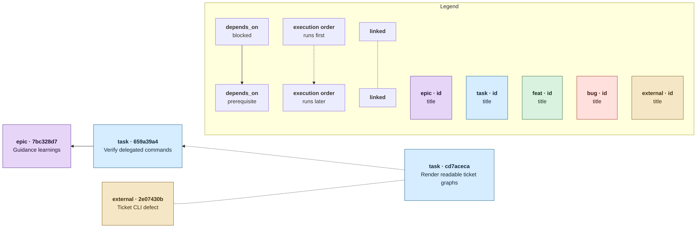

## Single-Block Contract

Render every ticket graph as one `mermaid` fenced code block. The block MUST contain a `subgraph Legend` that explains every edge class present and includes a sample node for every ticket type used. A copied block MUST reproduce the graph's complete meaning without adjacent prose.

## Direction And Edges

Use `flowchart RL`: prerequisites render to the left of the tickets they block, so scanning left-to-right lists blockers before blocked tickets. Read a solid dependency arrow from the blocked ticket on the right toward its prerequisite on the left.

- Stored `depends_on`: `A --> B` means "A is blocked by B"; the arrowhead points at prerequisite `B`.
- Derived execution order: `A -.-> B` means "A runs before B". When both relations describe one pair, the arrows point in opposite directions.
- Stored `linked`: `A -.- B` is an undirected association, not an execution dependency.

## Nodes And Layout

Label each ticket as `<b>{type} · {short-id}</b> {wrapped title}`. Use `htmlLabels: true`, generous `nodeSpacing` and `rankSpacing`, and padded `classDef` styles so wrapped titles are readable. Define and apply a distinct colour class for every type used: `epic`, `task`, `feat` (feature), `bug`, or `external`.

## Reference Diagram

