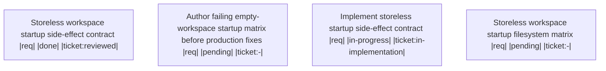

# Handoff: 3e46b2ae-07b4-430c-9371-2b0b256076bc

Make MCP servers and viewers safe to launch from arbitrary empty directories without silently polluting the filesystem.

## Upward Context
[fa2ba34b Session-anchored MCP workspace resolution](.ticket/tickets/fa2ba34b-59ec-4321-a4ce-a3c3a9295ea3/ticket.toml) (parent) -> [52724aed Startup artifact pollution: MCP servers/viewers must not create stores or log dirs on mere startup in storeless workspaces](.ticket/tickets/52724aed-7215-471b-b2d8-7fb425f5ed61/ticket.toml)

## Summary
- **Workspace Session**: `0a84c1a5-110a-48d0-bd54-e7d618740997`
- **Outgoing Run**: `3f40a1ed-0c05-4f06-b4ea-b53f4a80628f`
- **Created**: 2026-08-08T16:10:42.671739500+00:00
- **Objective**: Author the reusable storeless-workspace startup matrix first, run it to identify every MCP server/viewer that creates filesystem artifacts during mere startup, then remove those eager side effects while preserving explicit initialization and configured first-write behavior.
- **Implementation Ready**: true

## Resume Command
```bash
session-cli resume --workspace-session-id 0a84c1a5-110a-48d0-bd54-e7d618740997 --predecessor-run-id 3f40a1ed-0c05-4f06-b4ea-b53f4a80628f
```

## Target Tickets
| Ticket | What it does | Why |
| --- | --- | --- |
| [52724aed Startup artifact pollution: MCP servers/viewers must not create stores or log dirs on mere startup in storeless workspaces](.ticket/tickets/52724aed-7215-471b-b2d8-7fb425f5ed61/ticket.toml) | ## Objective
<br>
<br>Eliminate startup-time filesystem artifact pollution across MCP servers and viewers: no tool may create a `.ticket` store, `test-logs/`/`target/test-logs/` directories, or any other persistent artifact merely by starting up in a directory/workspace with no configured or initialized store/log sink. Creation of such artifacts must be deferred to the first actual configured write/init operation, never to process startup or read-only queries.
<br>
<br>## Authoritative Behavior (user-approved)
<br>
<br>1. ticket-mcp startup in a directory/workspace with no configured or initialized `.ticket` store must not create a store; persistent store creation requires explicit initialization/configuration.
<br>2. Generated output directories such as `test-logs/` and `target/test-logs/` are created lazily only on the first actual configured write, never during mere startup.
<br>3. When no filesystem log destination is configured, filesystem logging remains disabled (no log file/dir created as a side effect of enabling tracing/logging infrastructure).
<br>4. Validation is designed first, using fresh temporary storeless workspaces:
<br>   - Snapshot the filesystem before startup.
<br>   - Spawn every relevant MCP server/viewer startup with exit code, stdout, and stderr captured.
<br>   - Snapshot the filesystem after startup.
<br>   - Assert the filesystem delta is exactly empty (no created files/dirs) for the read-only/no-config case.
<br>   - Then run a positive case with explicit init/configured write and prove the intended artifact is created as expected.
<br>
<br>## Scope
<br>
<br>Do not assume `ticket-mcp` and `log-viewer` are the only creators. Investigate startup behavior across all installed MCP servers and viewers, including (subject to confirmation during implementation):
<br>
<br>- `memory-api/tools/mcp/ticket-mcp`
<br>- `memory-api/tools/mcp/session-mcp` (and `session-cli`)
<br>- `context-stack/tools/mcp/context-mcp`
<br>- `memory-viewers/ticket-viewer`
<br>- `memory-viewers/log-viewer`
<br>- `memory-viewers/doc-viewer`
<br>- `memory-viewers/spec-viewer`
<br>- any `spec-mcp`, `test-mcp`, `audit-mcp`, `feedback-mcp`, `fs-mcp` binaries present in `memory-api/tools/mcp/` or equivalent locations
<br>
<br>The investigation phase must enumerate the actual installed set (do not hardcode this list into the implementation without verifying against the repo) and identify, per tool, whether startup alone creates any of:
<br>- a `.ticket`/`.spec`/`.session`/`.feedback`/`.test` store directory
<br>- `test-logs/` or `target/test-logs/` (or any other logging output directory)
<br>- any other file/directory not explicitly requested by the caller
<br>
<br>## Root-Cause Investigation Notes (starting points, not exhaustive)
<br>
<br>- `memory-api/crates/memory-api/src/workspace.rs` workspace/store resolution helpers (referenced by ticket fa2ba34b-59ec-4321-a4ce-a3c3a9295ea3 for a related but distinct workspace-resolution defect) are a plausible shared resolution path worth checking for eager directory creation, but this must be confirmed by direct repository evidence rather than assumed.
<br>- Tracing/logging initialization code paths (wherever `config/tracing.toml` or equivalent is read) must be checked for eager `test-logs/`/`target/test-logs/` directory creation independent of an actual write.
<br>- Each MCP server's `main.rs`/server bootstrap should be checked for calls that create a store index root or log directory before any tool call is dispatched.
<br>
<br>## Acceptance Criteria
<br>
<br>1. A reusable empty-workspace fixture exists (e.g., a temp-dir helper) that produces a fresh, storeless workspace directory with no `.ticket`/`.spec`/`.session`/`.feedback`/`.test`/log-output artifacts, usable by both focused package tests and a repository-level fixture command.
<br>2. A parameterized startup test matrix exists covering every relevant installed MCP server/viewer entry point identified during investigation (not just ticket-mcp and log-viewer).
<br>3. For each tool in the matrix, starting the tool (or running its read-only/no-op startup path) against the empty-workspace fixture with no configured store/log sink produces a zero filesystem delta: before/after snapshots of the fixture directory are identical, verified by direct comparison, not by absence-of-error alone.
<br>4. For any tool whose normal operation requires a store to exist, invoking an operation against the empty-workspace fixture (no store configured/initialized) produces a clear, non-mutating error — the tool must not silently create the missing store as a side effect of the failed operation.
<br>5. A positive-path test exists proving that explicit initialization or an explicit configured write still creates the intended artifact (store directory, log file/dir) when the caller actually requests it — confirming the fix does not break legitimate lazy-creation behavior.
<br>6. Regression coverage exists that pinpoints the exact code path/creator responsible for the previously observed `test-logs/`/`target/test-logs/` creation-on-startup behavior (not just a passing/failing assertion, but a test that would fail again at the specific creator if reintroduced).
<br>7. Focused package-level tests pass for each affected crate/tool.
<br>8. A repository-level fixture/validation command exists (e.g., a script or test target) that can run the full startup matrix and report the delta-per-tool result in one invocation.
<br>
<br>## Non-Goals
<br>
<br>- Does not resolve the session-anchored workspace-resolution/store-divergence defect tracked in ticket fa2ba34b-59ec-4321-a4ce-a3c3a9295ea3; that ticket addresses cwd-vs-server-cwd store resolution, a related but distinct concern from startup-time artifact creation.
<br>- Does not import or restate unrelated pre-dispatch-gate requirements from orchestration instructions.
<br>
<br>## Related
<br>
<br>- Linked (not depends_on, pending direct evidence of a hard implementation dependency): ticket fa2ba34b-59ec-4321-a4ce-a3c3a9295ea3, "Session-anchored MCP workspace resolution: require session_id and resolve every proxied call to the session's active worktree" (state: open). Both concern MCP/tool startup and workspace/store resolution correctness, but fa2ba34b is scoped to session-to-worktree store resolution while this ticket is scoped to artifact creation timing (eager vs lazy). No repository evidence currently shows one is a hard prerequisite for the other.
<br> | Owns the startup artifact pollution regression and validation matrix. |

## Target Files
- `memory-api/tools/mcp/ticket-mcp/src/main.rs`
- `memory-viewers/log-viewer/Cargo.toml`

## Decisions
- Persistent stores such as .ticket require explicit initialization or configuration; mere startup must not create a store.
- Generated output directories such as test-logs/ and target/test-logs/ are created lazily only on the first actual configured write.
- Without an explicit filesystem log destination, filesystem logging remains disabled.
- The fixture captures exit status, stdout, stderr, and exact before/after filesystem snapshots for each discovered installed MCP server/viewer.
- Production fixes begin only after the failing matrix identifies the actual artifact creators.

## Non-Goals
- Do not ban intentional explicit store initialization or configured writes.
- Do not change configured log contents or retention behavior.
- Do not fold pre-dispatch agent quality gates into this implementation.
- Do not assume ticket-mcp and log-viewer are the only affected binaries before running the matrix.

## Context Anchors
- .ticket/tickets/[52724aed Startup artifact pollution: MCP servers/viewers must not create stores or log dirs on mere startup in storeless workspaces](.ticket/tickets/52724aed-7215-471b-b2d8-7fb425f5ed61/ticket.toml)/ticket.toml
- .spec/specs/939d066a-aeaa-41aa-a2f9-9fdb14fc1b3d/spec.toml

## Risk Notes
The first matrix run may reveal additional creators beyond ticket-mcp and log-viewer. Keep the production patch driven by observed filesystem deltas. The current session/worktree check-in proxy defect is related infrastructure risk but is not part of ticket [52724aed Startup artifact pollution: MCP servers/viewers must not create stores or log dirs on mere startup in storeless workspaces](.ticket/tickets/52724aed-7215-471b-b2d8-7fb425f5ed61/ticket.toml) unless a failing matrix proves direct overlap.

## Workflow
- **Nodes**: 4
- **Edges**: 0
- **Not Done**: 3



## Pinned Entities
- `ce://default/spec/939d066a-aeaa-41aa-a2f9-9fdb14fc1b3d` (spec)
- `ce://default/ticket/52724aed-7215-471b-b2d8-7fb425f5ed61` (ticket)

## Validation
- `vt-storeless-startup-matrix`: - (required)
