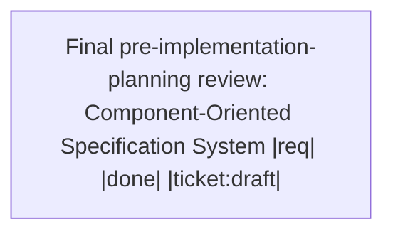

# Handoff: cfd036e2-d9e3-4cf4-acef-53a9a93a32cd

Deliver the Component-Oriented Specification System through Roadmap Waypoints 6 and 7.

## Upward Context
Component-Oriented Specification System (parent)

## Summary
- **Workspace Session**: `596bac34-e7a9-44f5-81f1-c2e308a3a215`
- **Outgoing Run**: `c0167b02-5648-4a69-9da6-e83b5e34033a`
- **Created**: 2026-08-23T05:49:18.528576+00:00
- **Objective**: Derive non-overlapping implementation tickets for the Component-Oriented Specification System after recording the mechanical navigation-parity correction.
- **Implementation Ready**: true

## Resume Command
```bash
session-cli resume --session-id 596bac34-e7a9-44f5-81f1-c2e308a3a215 --predecessor-run-id c0167b02-5648-4a69-9da6-e83b5e34033a
```

## Target Files
- `workflow-tools/spec/crates/spec-api/src/manifest.rs`
- `workflow-tools/spec/crates/spec-api/src/store.rs`
- `workflow-tools/doc/crates/doc-api/src/lib.rs`
- `workflow-tools/test/crates/test-api/src/lib.rs`

## Decisions
- All live children have concrete responsibility, target code anchors, examples, provider/consumer contracts, and dependencies.
- D12 224f9384 is standalone-ticket-ready and is a prerequisite for document evidence resolution.
- Shared operation journal work is externally governed by aa769a27 and open ticket 73b2cd22.
- Ticket slices must assign manifest.rs to one component-artifact slice and store.rs to one persistence/health slice to avoid overlapping primary ownership.

## Non-Goals
- Do not implement code, create tickets, or transition spec state during this review.
- Do not reopen settled identity, validation-gate, migration, or presentation contracts.

## Context Anchors
- Live root f1b8f01a and D12 224f9384 reviewed from current bodies and manifests.
- spec health --all: 275 specs checked and exactly three documented 9f0b9e30 findings.
- cargo test -p spec-api --test schema_test: 10 passed.
- 73817390 contains D12 in Reading Order but has no Component Relationship Map; root has both link and graph.

## Risk Notes
No decision-sized blocker. Mechanical pre-ticket correction: add the required handwritten Component Relationship Map to parent 73817390 for its D12 child; root navigation is present. Audit could not run on the assigned worktree because its ticket-viewer submodule path is absent.

## Workflow
- **Nodes**: 1
- **Edges**: 0
- **Not Done**: 0



## Pinned Entities
- `ce://default/spec/224f9384-c38f-4d8b-855e-a8b2457887ca` (spec)
- `ce://default/spec/f1b8f01a-c7da-4a71-97c5-39519a7d7f38` (spec)

## Validation
- `spec-api-schema-test`: passed (required)
- `spec-health-live-root`: passed (required)
