# Handoff: 471672fd-fadd-462c-922b-99274020b510

Exercise live worktree attribution

## Summary
- **Workspace Session**: `6ae5e73a-396f-43bf-964d-0d7e73bf3d60`
- **Outgoing Run**: `80c7658d-c4d1-476b-920b-6f78652a5f4e`
- **Created**: 2026-08-15T23:30:51.843313+00:00
- **Objective**: Verify installed session-mcp resolves handoff paths in the assigned worktree
- **Implementation Ready**: false

## Resume Command
```bash
session-cli resume --session-id 6ae5e73a-396f-43bf-964d-0d7e73bf3d60 --predecessor-run-id 80c7658d-c4d1-476b-920b-6f78652a5f4e
```

## Target Files
- `.agents/agents/explainer.agent.md`

## Decisions
- Use the active session worktree for path validation

## Non-Goals
- No implementation-ready handoff is created

## Context Anchors
- ce://default/ticket/[79449c3f Define Explainer Agent version-one contract](.ticket/tickets/79449c3f-2f49-4925-b8fd-3751face53b5/ticket.toml)

## ⚠️ Open Escalations
- Live routing verification only

## Risk Notes
The broader proxy session-id enforcement remains open

## Workflow
- **Nodes**: 9
- **Edges**: 0
- **Not Done**: 0

```mermaid
flowchart TD
  nexplainer_approval_granularity["Explainer Agent approval: one bounded read-only research plan |req| |done| |ticket:-|"]
  nexplainer_feedback_retention["Explainer Agent feedback retention: repository lifecycle |req| |done| |ticket:-|"]
  nexplainer_feedback_visibility["Explainer Agent feedback visibility: team-visible |req| |done| |ticket:-|"]
  nexplainer_learning_boundary["Explainer Agent learning: feedback analysis only |req| |done| |ticket:-|"]
  nexplainer_pilot_threshold["Explainer Agent pilot: 5 runs, mean ratings >= 4/5, zero boundary violations |req| |done| |ticket:-|"]
  nexplainer_preapproval_reading["Explainer Agent may fully read repository content before initial explanation |req| |done| |ticket:-|"]
  nexplainer_reapproval_boundary["Explainer Agent re-approval: new target or changed outcome |req| |done| |ticket:-|"]
  nexplainer_v1_executor["Explainer Agent v1 executor: human |req| |done| |ticket:-|"]
  nexplainer_v1_scope["Explainer Agent v1 scope: read-only research |req| |done| |ticket:-|"]
```


