# Handoff: b83774a7-18e0-49f0-85e1-b023723ef468

Provide evidence-based task explanations while keeping execution under human control

## Upward Context
[79449c3f Define Explainer Agent version-one contract](.ticket/tickets/79449c3f-2f49-4925-b8fd-3751face53b5/ticket.toml) (parent) -> [79449c3f Define Explainer Agent version-one contract](.ticket/tickets/79449c3f-2f49-4925-b8fd-3751face53b5/ticket.toml)

## Summary
- **Workspace Session**: `6ae5e73a-396f-43bf-964d-0d7e73bf3d60`
- **Outgoing Run**: `844ae9ad-7316-4cf3-a90a-b7026f765f8e`
- **Created**: 2026-08-15T16:45:51.279663800+00:00
- **Objective**: Create the linked Explainer Agent specification and implementation-ready template contract
- **Implementation Ready**: true

## Resume Command
```bash
session-cli resume --session-id 6ae5e73a-396f-43bf-964d-0d7e73bf3d60 --predecessor-run-id 844ae9ad-7316-4cf3-a90a-b7026f765f8e
```

## Target Tickets
| Ticket | What it does | Why |
| --- | --- | --- |
| [79449c3f Define Explainer Agent version-one contract](.ticket/tickets/79449c3f-2f49-4925-b8fd-3751face53b5/ticket.toml) |  | captures the approved version-one contract |

## Decisions
- Version one is a read-and-explain agent; the human executes tasks.
- Full repository reading is allowed before the initial explanation.
- Feedback is team-visible and informs only later human-reviewed changes.

## Non-Goals
- No task mutation, delegation, self-modification, or model training in version one.

## Context Anchors
- transcripts/15-08-2026_explainer-agent-human-loop/01-explainer-agent-plan.md

## Risk Notes
The template must distinguish unrestricted pre-explanation reads from a later execution-capable approval boundary.

## Workflow
- **Nodes**: 9
- **Edges**: 0
- **Not Done**: 0

```mermaid
flowchart TD
  nexplainer_approval_granularity["Explainer Agent approval: one bounded read-only research plan |req| |done| |ticket:-|"]
  nexplainer_feedback_retention["Explainer Agent feedback retention: repository lifecycle |req| |done| |ticket:-|"]
  nexplainer_feedback_visibility["Explainer Agent feedback visibility: team-visible |req| |done| |ticket:-|"]
  nexplainer_learning_boundary["Explainer Agent learning: feedback analysis only |req| |done| |ticket:-|"]
  nexplainer_pilot_threshold["Explainer Agent pilot: 5 runs, mean ratings >= 4/5, zero boundary violations |req| |done| |ticket:-|"]
  nexplainer_preapproval_reading["Explainer Agent may fully read repository content before initial explanation |req| |done| |ticket:-|"]
  nexplainer_reapproval_boundary["Explainer Agent re-approval: new target or changed outcome |req| |done| |ticket:-|"]
  nexplainer_v1_executor["Explainer Agent v1 executor: human |req| |done| |ticket:-|"]
  nexplainer_v1_scope["Explainer Agent v1 scope: read-only research |req| |done| |ticket:-|"]
```


