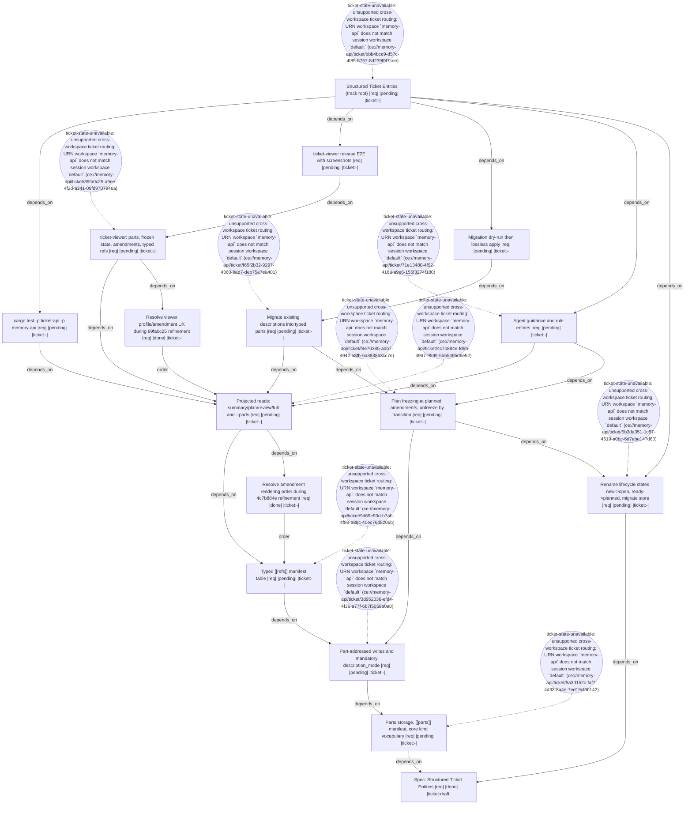

# Handoff: 087da925-e599-4e95-a96f-69a86433b2ed

## Summary
- **Workspace Session**: `78a67ddb-1d98-4f9f-8d41-4d938bb07b35`
- **Outgoing Run**: `a4ec3d56-95d2-44f2-8146-a6a445fc90ec`
- **Created**: 2026-07-29T13:41:52.831885700+00:00
- **Objective**: Implement the full Structured Ticket Entities track (epic bbb4bce9) in one orchestrated session, executing nine capability tickets in dependency order against spec 24b3d22b: lifecycle state rename, parts/ storage and manifest, part-addressed writes with mandatory description_mode, typed refs, plan freezing at `planned`, projected reads, lossless description migration, ticket-viewer rendering, and agent guidance.
- **Implementation Ready**: true

## Resume Command
```bash
session-cli resume --workspace-session-id 78a67ddb-1d98-4f9f-8d41-4d938bb07b35 --predecessor-run-id a4ec3d56-95d2-44f2-8146-a6a445fc90ec
```

## Target Tickets
- `bbb4bce9-d57c-4f85-8757-8d239f9f7cde`
- `5b3da351-1c87-4619-a0bc-6d7abe147d60`
- `5a3d152c-faf7-4d33-8a4e-7ed19cf6b142`
- `3d952036-efd4-4f36-a77f-6b7f5058a0a0`
- `9d69e93d-b7ab-4f88-a88c-40ec76d5206b`
- `f9e70385-adb7-4942-a8fb-6a383863cc7e`
- `4c7b884e-fd9b-4967-9599-5b55495d6e52`
- `f65f2b32-9297-4360-9ad7-deb75e7ea401`
- `89fa0c25-a9ee-4f2d-a341-09fd9707946a`
- `71e13480-4f92-418a-a9e6-155f3274f180`

## Target Files
- `memory-api/crates/ticket-api/src/model/filesystem.rs`
- `memory-api/crates/ticket-api/src/model/ticket.rs`
- `memory-api/crates/ticket-api/src/model/schema_registry.rs`
- `memory-api/crates/ticket-api/src/storage/store.rs`
- `memory-api/crates/ticket-api/src/storage/ticket_fs.rs`
- `memory-api/crates/memory-api/src/model/entity.rs`
- `memory-api/crates/memory-api/src/model/edge.rs`
- `memory-viewers/ticket-viewer/frontend/dioxus`

## Decisions
- The memory-api ticket schema currently has no `planned` state (new -> ready). New ticket 5b3da351 renames `new` -> `open` and `ready` -> `planned` and migrates every ticket.toml and history.ndjson. f9e70385 (freezing) and the epic both depend on it.
- Migration never bypasses the freeze: a ticket already in `planned` is transitioned back to a pre-`planned` state, split, then re-entered into `planned` to re-freeze and cut a new plan revision.
- Parts are addressed by a stable opaque part id assigned at creation. The `[[parts]]` manifest carries id, kind, path, frozen, created_at, and optional supersedes. Manifest order is display-only and never an addressing key.
- `supersedes` is reserved in the manifest schema from 5a3d152c onward, unused until f9e70385 lands, so the manifest contract never changes shape mid-track.
- Both `[[parts]]` and `[[refs]]` are parsed by the ticket manifest model in memory-api/crates/ticket-api/src/model/filesystem.rs. 9d69e93d is serialised after 3d952036 to avoid a merge collision on that struct.
- f65f2b32 depends on f9e70385 because migration reasons about frozen state.
- Migration creates one `notes` part per matched heading and never merges `## Status` with `## Handoff`; heading provenance is preserved.
- Amendment rendering: in the `plan` and `full` profiles, each frozen part is followed by its amendments inline directly beneath it, newest last. No trailing amendments section, no hidden superseded text.
- ticket-viewer has NO profile switcher. It always renders the `full` projection with per-part collapse/expand, and amendments inline beneath their frozen part.
- 4c7b884e gains an explicit acceptance criterion that profiles and `--parts` work against a legacy ticket with no `[[parts]]` table, reading description.md as the sole objective part.
- Every leaf ticket carries a final acceptance criterion requiring a test-api validation execution per criterion, linked to that ticket id. The epic's evidence gate is discharged by the leaves.
- 3d952036 owns only the minimal instruction-file correctness fix (description_mode is required); 71e13480 owns the full guidance rewrite covering profiles, freeze contract, and per-role part ownership.
- Effort is expressed as a token budget, not a t-shirt size, so the ticket health checker passes.

## Non-Goals
- Reworking the edge model or migrating existing free-form edge kinds.
- A general query expression language over tickets; profiles plus an explicit part list are the whole projection surface.
- Retention limits or compaction of history.ndjson.
- Adding new lifecycle states beyond the `new`->`open` and `ready`->`planned` rename; the transition graph shape is unchanged.
- Re-opening any of the recorded decisions; they are user-approved.
- Re-deriving designs or searching the codebase for structure already recorded in each ticket's Design and Implementation Steps sections.

## Context Anchors
- Workflow graph is persisted in this session's durable workflow. Nodes: spec-anchor (done), r-deferred-amendment-order (done), r-deferred-viewer-ux (done), t0-state-rename, t1-parts-storage, t2-part-writes, t3-typed-refs, t4-freezing, t5-projections, t6-migration, t7-viewer, t8-guidance, validations v-workspace-build / v-migration-dryrun / v-viewer-e2e, and epic-root. Render with session_workflow_render_terminal or render_mermaid.
- Strict serial execution order for one orchestrated session: 5b3da351 (state rename) and 5a3d152c (parts storage) can start in parallel, then 3d952036 -> 9d69e93d -> f9e70385 (needs both 3d952036 and 5b3da351) -> 4c7b884e -> {f65f2b32, 89fa0c25, 71e13480} -> validations.
- 9d69e93d is deliberately serialised after 3d952036 because both extend the same ticket manifest struct in filesystem.rs. Do not run them in parallel.
- All ten tickets are at state `ready` and carry an ordered `## Implementation Steps` section naming real files and types. The implementer needs no further discovery; do not re-derive the design.
- Real type names confirmed during refinement: memory_api::model::entity::EntityManifest re-exported as TicketManifest from ticket-api/src/model/ticket.rs; TOML parse entry point parse_ticket_manifest_toml in ticket-api/src/model/filesystem.rs; file-backed CRUD in ticket-api/src/storage/ticket_fs.rs (TicketFs::create/read/update, scan_root); core-kind validation via SchemaRegistry::validate_manifest in ticket-api/src/model/schema_registry.rs.
- Validation specs already recorded in both the root and memory-api .test stores: vt-structured-ticket-entities-rust, vt-structured-ticket-entities-viewer-e2e, vt-structured-ticket-entities-migration. Record executions against these ids, linked to the implementing ticket.
- Effort values are token budgets: bbb4bce9=8000, 5a3d152c=4200, f65f2b32=3800, f9e70385=3400, 5b3da351=3200, 3d952036=3000, 9d69e93d=2800, 4c7b884e=2600, 89fa0c25=2400, 71e13480=2200. health_check on root bbb4bce9 returns finding_count=0 across all 10 tickets.
- Planning commits so far: 071401b6 (spec), efd073a4 (ticket track), 71cde593 (submodule pointer).

## Risk Notes
Highest-risk items, in order: (1) The state rename 5b3da351 rewrites every ticket.toml and history.ndjson in the store and must land before f9e70385; take a git checkpoint and dry-run first. (2) `description_mode` becoming required is a breaking change across CLI, ticket-mcp tool schema, HTTP transport, ticket-viewer, and tests; 3d952036 carries a Call Sites inventory and compile breakage is expected until every site is updated. (3) 3d952036 and 9d69e93d both touch the manifest struct in filesystem.rs and must not run in parallel. (4) The description migration f65f2b32 runs against 50+ affected tickets, three over 1000 lines; dry-run and diff before apply. (5) Two store migrations (state rename, description split) touch the same files; sequence them and verify each with an idempotent re-run.

## Workflow
- **Nodes**: 16
- **Edges**: 24
- **Not Done**: 13



## Validation
- `vt-structured-ticket-entities-migration`: - (required)
- `vt-structured-ticket-entities-rust`: - (required)
- `vt-structured-ticket-entities-viewer-e2e`: - (required)

## Diagnostics
- **epic-root** [ticket-state-unavailable]: unsupported cross-workspace ticket routing: URN workspace `memory-api` does not match session workspace `default` (ce://memory-api/ticket/bbb4bce9-d57c-4f85-8757-8d239f9f7cde)
- **t0-state-rename** [ticket-state-unavailable]: unsupported cross-workspace ticket routing: URN workspace `memory-api` does not match session workspace `default` (ce://memory-api/ticket/5b3da351-1c87-4619-a0bc-6d7abe147d60)
- **t1-parts-storage** [ticket-state-unavailable]: unsupported cross-workspace ticket routing: URN workspace `memory-api` does not match session workspace `default` (ce://memory-api/ticket/5a3d152c-faf7-4d33-8a4e-7ed19cf6b142)
- **t2-part-writes** [ticket-state-unavailable]: unsupported cross-workspace ticket routing: URN workspace `memory-api` does not match session workspace `default` (ce://memory-api/ticket/3d952036-efd4-4f36-a77f-6b7f5058a0a0)
- **t3-typed-refs** [ticket-state-unavailable]: unsupported cross-workspace ticket routing: URN workspace `memory-api` does not match session workspace `default` (ce://memory-api/ticket/9d69e93d-b7ab-4f88-a88c-40ec76d5206b)
- **t4-freezing** [ticket-state-unavailable]: unsupported cross-workspace ticket routing: URN workspace `memory-api` does not match session workspace `default` (ce://memory-api/ticket/f9e70385-adb7-4942-a8fb-6a383863cc7e)
- **t5-projections** [ticket-state-unavailable]: unsupported cross-workspace ticket routing: URN workspace `memory-api` does not match session workspace `default` (ce://memory-api/ticket/4c7b884e-fd9b-4967-9599-5b55495d6e52)
- **t6-migration** [ticket-state-unavailable]: unsupported cross-workspace ticket routing: URN workspace `memory-api` does not match session workspace `default` (ce://memory-api/ticket/f65f2b32-9297-4360-9ad7-deb75e7ea401)
- **t7-viewer** [ticket-state-unavailable]: unsupported cross-workspace ticket routing: URN workspace `memory-api` does not match session workspace `default` (ce://memory-api/ticket/89fa0c25-a9ee-4f2d-a341-09fd9707946a)
- **t8-guidance** [ticket-state-unavailable]: unsupported cross-workspace ticket routing: URN workspace `memory-api` does not match session workspace `default` (ce://memory-api/ticket/71e13480-4f92-418a-a9e6-155f3274f180)
