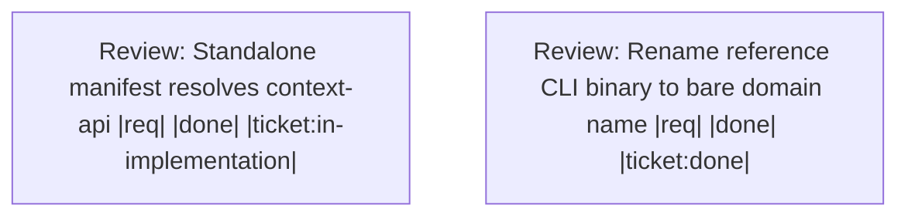

# Handoff: 0c08cca1-fc18-4929-9fdd-003496c2816f

Validate and complete the single domain-crate prerequisite, then review and merge the ticket extraction across all clean rebased submodules and the superproject.

## Upward Context
[ba4aaa9c Extract ticket domain crate](.ticket/tickets/ba4aaa9c-d270-4cfc-a1e2-395634608371/ticket.toml) (parent) -> [0da6894c [workflow-tools][design] Single domain crate per tool: unify api + transports as one crate with transport binary targets](.ticket/tickets/0da6894c-dcbb-4196-8ac7-b6fae7c40ec9/ticket.toml)

## Summary
- **Workspace Session**: `c8ebe499-682c-4f3d-86ea-209b78a8af3b`
- **Outgoing Run**: `e9028566-b1b5-4215-a663-d0ff5b0bfc46`
- **Created**: 2026-08-16T15:02:54.127177300+00:00
- **Objective**: Use Rust 1.99.0-nightly after clearing stale target artifacts, repair the Makefile TOML parse failure, and produce fresh passing ticket tests and native-binary build evidence before resuming the bottom-up merge.
- **Implementation Ready**: true

## Resume Command
```bash
session-cli resume --session-id c8ebe499-682c-4f3d-86ea-209b78a8af3b --predecessor-run-id e9028566-b1b5-4215-a663-d0ff5b0bfc46
```

## Target Tickets
| Ticket | What it does | Why |
| --- | --- | --- |
| [0da6894c [workflow-tools][design] Single domain crate per tool: unify api + transports as one crate with transport binary targets](.ticket/tickets/0da6894c-dcbb-4196-8ac7-b6fae7c40ec9/ticket.toml) | Phase A design/contract. Define the canonical per-domain crate layout that every tool extraction must follow: a single domain crate (named after the domain, e.g. `ticket`) that unifies the domain API and all transports into one build target, with each transport exposed as a binary target of that crate.<br><br>## Decision (locked 2026-07-25, refined after review)<br>- Collapse the previous multi-crate transport split into ONE domain crate `{domain}`.<br>- The domain crate's library is the primary build target and the public domain handle.<br>- `{domain}-api` remains its own internal crate; the domain crate depends on it and re-exports its public surface. The domain crate lib is the internal API re-export plus transport-agnostic wiring.<br>- Each transport (CLI, MCP, HTTP, future) is a binary build target (`[[bin]]`) of the domain crate, sharing the crate lib. Transport-specific code lives in `src/bin/*` (or gated modules), not separate transport crates.<br>- Transport bins use the shared `transport-harness` crate (`dbe0e955`) so CLI/MCP/HTTP boilerplate is not duplicated across the 11 domain crates.<br>- Transport binaries are feature-gated. Consumers enable the features they need, such as `--features cli,mcp`; a slim consumer can build the lib only.<br>- Binary names preserve the current interface tool names (`{domain}-cli`, `{domain}-mcp`, `{domain}-http`).<br>- Frontends stay separate: the domain viewer (Dioxus/WASM) and any VS Code extension remain their own crates/packages, depending on the domain crate lib.<br><br>## Delivered Contract<br>- Specification: `workflow-tools/domain-crate-contract` (`5ee7f36a-2aea-4373-8c67-e6b26ae174bf`).<br>- Human-readable contract: `WORKFLOW_TOOLS_DOMAIN_CRATE_CONTRACT.md`.<br>- Compiling reference workspace: `workflow-tools-contract-reference`, with `example-api`, public `example`, and `transport-harness` crates.<br>- The reference manifest proves the `[lib]`, API re-export, empty default feature set, and feature-gated CLI/MCP/HTTP `[[bin]]` pattern.<br>- Per-tool tickets already reference this contract and the shared harness ticket.<br><br> | Prerequisite is in implementation after failed review and blocks [ba4aaa9c [workflow-tools][per-tool] Extract ticket tool as a single `ticket` domain crate (api + transport bins) + viewer/vscode frontends](.ticket/tickets/ba4aaa9c-d270-4cfc-a1e2-395634608371/ticket.toml). |

## Target Files
- `Makefile.toml`
- `target/`
- `.ticket/tickets/0da6894c-dcbb-4196-8ac7-b6fae7c40ec9/`

## Decisions
- User selected nightly-clean-rebuild: clear stale target artifacts and rebuild with active Rust 1.99.0-nightly.
- Repair the exact invalid basic string at Makefile.toml line 295 before rerunning native builds.
- Do not merge submodules or the superproject until cargo test -p ticket-api, cargo test -p ticket, and cargo make build-native-tools pass.

## Non-Goals
- Do not switch to Rust 1.95.0.
- Do not bypass failed tests or build failures.
- Do not rebase or alter submodule branches unless new validation makes that necessary.
- Do not merge any branch into main during the repair step.

## Context Anchors
- Failed review: cargo test -p ticket-api and cargo test -p ticket reported 1.95.0 target artifacts conflicting with active 1.99.0-nightly.
- Failed review: cargo make build-native-tools reported Makefile.toml line 295 invalid basic string.
- git submodule status --recursive had no -, +, or U markers.
- WIP commit 7a7230fc preserved the first failed-review state.

## Risk Notes
Run the clean rebuild in the intended worktree only. Treat any fresh test/build failure as an implementation defect requiring repair before review and merge.

## Workflow
- **Nodes**: 2
- **Edges**: 0
- **Not Done**: 0



## Pinned Entities
- `ce://default/spec/5ee7f36a-2aea-4373-8c67-e6b26ae174bf` (spec)
- `ce://default/ticket/379ac56a-4580-4ed6-a571-eb76282ef375` (ticket)
- `ce://default/ticket/53b14bf8-3243-4cd6-909e-17c431812441` (ticket)

## Validation
- `native-tools-after-makefile-fix`: pending (required)
- `ticket-domain-tests-after-clean-rebuild`: pending (required)
