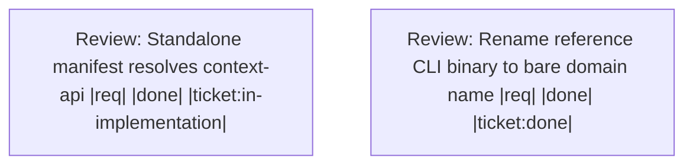

# Handoff: 881aeba1-c050-4a71-9200-a30e1daf7a46

Complete the single-domain-crate contract and then merge the ticket extraction bottom-up across all rebased submodules and the superproject.

## Upward Context
[ba4aaa9c Extract ticket domain crate](.ticket/tickets/ba4aaa9c-d270-4cfc-a1e2-395634608371/ticket.toml) (parent) -> [0da6894c [workflow-tools][design] Single domain crate per tool: unify api + transports as one crate with transport binary targets](.ticket/tickets/0da6894c-dcbb-4196-8ac7-b6fae7c40ec9/ticket.toml)

## Summary
- **Workspace Session**: `c8ebe499-682c-4f3d-86ea-209b78a8af3b`
- **Outgoing Run**: `e9028566-b1b5-4215-a663-d0ff5b0bfc46`
- **Created**: 2026-08-16T14:04:34.038474+00:00
- **Objective**: Repair the post-rebase validation environment and Makefile TOML so ticket 0da6894c can pass current ticket-domain tests and the native-binary build before reviewing the dependent ticket extraction.
- **Implementation Ready**: true

## Resume Command
```bash
session-cli resume --session-id c8ebe499-682c-4f3d-86ea-209b78a8af3b --predecessor-run-id e9028566-b1b5-4215-a663-d0ff5b0bfc46
```

## Target Tickets
| Ticket | What it does | Why |
| --- | --- | --- |
| [0da6894c [workflow-tools][design] Single domain crate per tool: unify api + transports as one crate with transport binary targets](.ticket/tickets/0da6894c-dcbb-4196-8ac7-b6fae7c40ec9/ticket.toml) | Phase A design/contract. Define the canonical per-domain crate layout that every tool extraction must follow: a single domain crate (named after the domain, e.g. `ticket`) that unifies the domain API and all transports into one build target, with each transport exposed as a binary target of that crate.<br><br>## Decision (locked 2026-07-25, refined after review)<br>- Collapse the previous multi-crate transport split into ONE domain crate `{domain}`.<br>- The domain crate's library is the primary build target and the public domain handle.<br>- `{domain}-api` remains its own internal crate; the domain crate depends on it and re-exports its public surface. The domain crate lib is the internal API re-export plus transport-agnostic wiring.<br>- Each transport (CLI, MCP, HTTP, future) is a binary build target (`[[bin]]`) of the domain crate, sharing the crate lib. Transport-specific code lives in `src/bin/*` (or gated modules), not separate transport crates.<br>- Transport bins use the shared `transport-harness` crate (`dbe0e955`) so CLI/MCP/HTTP boilerplate is not duplicated across the 11 domain crates.<br>- Transport binaries are feature-gated. Consumers enable the features they need, such as `--features cli,mcp`; a slim consumer can build the lib only.<br>- Binary names preserve the current interface tool names (`{domain}-cli`, `{domain}-mcp`, `{domain}-http`).<br>- Frontends stay separate: the domain viewer (Dioxus/WASM) and any VS Code extension remain their own crates/packages, depending on the domain crate lib.<br><br>## Delivered Contract<br>- Specification: `workflow-tools/domain-crate-contract` (`5ee7f36a-2aea-4373-8c67-e6b26ae174bf`).<br>- Human-readable contract: `WORKFLOW_TOOLS_DOMAIN_CRATE_CONTRACT.md`.<br>- Compiling reference workspace: `workflow-tools-contract-reference`, with `example-api`, public `example`, and `transport-harness` crates.<br>- The reference manifest proves the `[lib]`, API re-export, empty default feature set, and feature-gated CLI/MCP/HTTP `[[bin]]` pattern.<br>- Per-tool tickets already reference this contract and the shared harness ticket.<br><br> | Prerequisite design ticket failed review after the rebase; [ba4aaa9c [workflow-tools][per-tool] Extract ticket tool as a single `ticket` domain crate (api + transport bins) + viewer/vscode frontends](.ticket/tickets/ba4aaa9c-d270-4cfc-a1e2-395634608371/ticket.toml) remains blocked until current validation succeeds. |

## Target Files
- `Makefile.toml`
- `.ticket/tickets/0da6894c-dcbb-4196-8ac7-b6fae7c40ec9/`
- `target/`

## Decisions
- User approved bottom-up ordering: review and close [0da6894c [workflow-tools][design] Single domain crate per tool: unify api + transports as one crate with transport binary targets](.ticket/tickets/0da6894c-dcbb-4196-8ac7-b6fae7c40ec9/ticket.toml) before [ba4aaa9c [workflow-tools][per-tool] Extract ticket tool as a single `ticket` domain crate (api + transport bins) + viewer/vscode frontends](.ticket/tickets/ba4aaa9c-d270-4cfc-a1e2-395634608371/ticket.toml).
- User approved a WIP commit for the failed-review state.
- Recursive submodule status is clean; do not rebase or change submodule branches unless fresh validation establishes a new necessity.

## Non-Goals
- Do not merge any submodule or the superproject into main until ticket-domain tests and cargo make build-native-tools pass.
- Do not treat the Rust target-cache mismatch as passing evidence.
- Do not resolve unrelated worktree changes.

## Context Anchors
- Review evidence: cargo test -p ticket-api and cargo test -p ticket failed due to Rust 1.95.0 target artifacts conflicting with active Rust 1.99.0-nightly.
- Review evidence: cargo make build-native-tools failed because Makefile.toml line 295 contains an invalid TOML string.
- Review evidence: git submodule status --recursive reported no -, +, or U markers.
- Review evidence: git diff --check passed.

## Risk Notes
Clear or isolate stale Cargo artifacts using the repository-approved build environment, repair the exact Makefile.toml syntax defect, rerun focused tests and build-native-tools, then resume prerequisite review.

## Workflow
- **Nodes**: 2
- **Edges**: 0
- **Not Done**: 0



## Pinned Entities
- `ce://default/spec/5ee7f36a-2aea-4373-8c67-e6b26ae174bf` (spec)
- `ce://default/ticket/379ac56a-4580-4ed6-a571-eb76282ef375` (ticket)
- `ce://default/ticket/53b14bf8-3243-4cd6-909e-17c431812441` (ticket)

## Validation
- `post-rebase-native-build`: failed: invalid TOML string at Makefile.toml line 295 (required)
- `post-rebase-ticket-tests`: failed: cargo test -p ticket-api and cargo test -p ticket hit Rust 1.95.0 vs Rust 1.99.0-nightly artifact mismatch (required)
