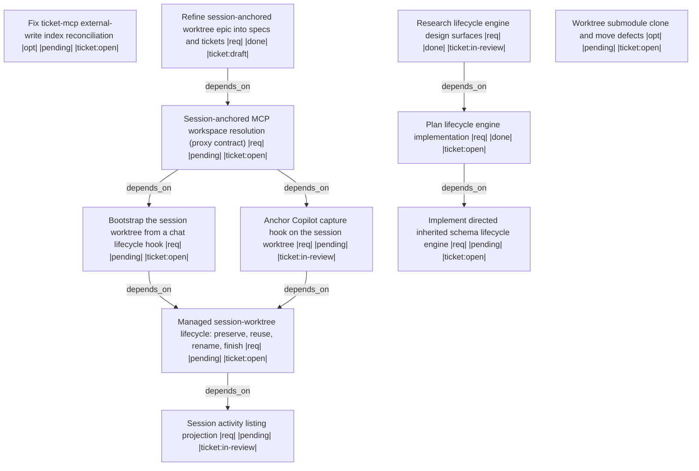

# Handoff: a60ebe3e-187e-4567-a137-1bef0ea684a8

Eliminate the silent split-brain where MCP entity writes land in the main checkout while CLI and file writes land in the agent's worktree. Completing this epic is the stated precondition for switching the repository back to a worktree-isolated agent workflow.

## Upward Context
Default worktree-backed session workflow (epic) -> Session-anchored MCP workspace resolution (phase) -> [fa2ba34b Session-anchored MCP workspace resolution: require session_id and resolve every proxied call to the session's active worktree](.ticket/tickets/fa2ba34b-59ec-4321-a4ce-a3c3a9295ea3/ticket.toml) (parent) -> [fa2ba34b Session-anchored MCP workspace resolution: require session_id and resolve every proxied call to the session's active worktree](.ticket/tickets/fa2ba34b-59ec-4321-a4ce-a3c3a9295ea3/ticket.toml), [40349f3f Copilot capture hook does not record worktree assignment, leaving every passively captured session unlinked](.ticket/tickets/40349f3f-8d04-4bf6-9241-b79425c10a97/ticket.toml), [3d535b2c [session-api][workflow] Add prompt-time worktree bootstrap hook](.ticket/tickets/3d535b2c-7361-4f08-bfb4-63b0b3174afc/ticket.toml), [ff83caf7 [session-api][tooling] Managed session-worktree lifecycle: preserve, reuse, rename, and finish](.ticket/tickets/ff83caf7-059b-4f2e-a0fb-eaa7757096a8/ticket.toml), [c060bf94 [ticket-api][board][session-api] Bind board entries to sessions and worktrees; add active-worktree discovery](.ticket/tickets/c060bf94-2435-4cc5-8016-ca1d2c8264f5/ticket.toml)

## Summary
- **Workspace Session**: `epic-kickoff-8fdfe135`
- **Outgoing Run**: `a2659767-3224-48e2-a9a9-72c9582c8515`
- **Created**: 2026-08-06T15:15:44.371159200+00:00
- **Objective**: Kick off implementation of the session-anchored worktree epic, starting with ticket fa2ba34b: make every proxied MCP call carry a session id and resolve to that session's active worktree root, rejecting unresolvable calls instead of silently defaulting to the server process cwd.
- **Implementation Ready**: true

## Resume Command
```bash
session-cli resume --workspace-session-id epic-kickoff-8fdfe135 --predecessor-run-id a2659767-3224-48e2-a9a9-72c9582c8515
```

## Target Tickets
| Ticket | What it does | Why |
| --- | --- | --- |
| [fa2ba34b Session-anchored MCP workspace resolution: require session_id and resolve every proxied call to the session's active worktree](.ticket/tickets/fa2ba34b-59ec-4321-a4ce-a3c3a9295ea3/ticket.toml) | ## Objective<br><br>Eliminate silent ticket-store divergence between a worktree agent's file/CLI edits and ticket-mcp MCP writes.<br><br>## Reproduction<br><br>ticket-mcp server launched from main checkout via VS Code; agent operates in .worktrees/<name>; use MCP with workspace default to create/write ticket while reading/writing .ticket via CLI/files inside worktree; writes land in different stores. Actual incident caused 17-file / 82,453-byte manual recovery harvest.<br><br>## Root Cause<br><br>- memory-api/tools/mcp/ticket-mcp/src/main.rs lines 14-20: `let index_root = std::env::var("TICKET_INDEX_ROOT")\n    .map(PathBuf::from)\n    .unwrap_or_else(\|_\| {\n        let (path, _source) = ticket_api::workspace::resolve_workspace();\n        path\n    });`<br>- memory-api/crates/memory-api/src/workspace.rs lines 108-114: `pub fn working_dir() -> Option<PathBuf> {\n    resolve_working_dir(\n        std::env::current_dir().ok().as_deref(),\n        std::env::var_os("PWD").as_deref().map(Path::new),\n    )\n}`<br>- memory-api/tools/mcp/ticket-mcp/src/server.rs lines 100-106: `if workspace.is_empty() \|\| workspace == "default" {\n    return Ok(self.index_root.clone());\n}`<br>- .vscode/mcp.json lines 16-22: ticket-mcp runs `mcp-toolmon -- ticket-mcp` with no `cwd` and no `TICKET_INDEX_ROOT`, inheriting VS Code's main checkout workspace folder for the session.<br><br>## Impact<br><br>.ticket is version-controlled; worktrees have independent copies; main-store MCP writes and worktree CLI/file writes silently fork authority.<br><br>## Acceptance Criteria<br><br>1. With caller cwd inside a worktree, MCP ticket writes either resolve to the worktree ticket store OR produce an explicit error/warning naming both candidate absolute store roots; silent divergence eliminated.<br>2. A tool call or startup log exposes the absolute store root to which default resolved.<br>3. Regression test covers worktree-cwd-vs-server-cwd divergence.<br>4. Record follow-up that .agents/instructions/commit/branch-worktree.instructions.md likely needs a companion rule: ticket-store edits must NOT be performed from a worktree; do not edit that guidance in this ticket.<br><br><br>## Widened Scope (2026-08-06): session-anchored resolution across every proxied server<br><br>The original scope above treats this as a ticket-mcp defect. It is not. `default` resolving to the server process cwd is a property of every MCP server fronted by `mcp-toolmon`, so the fix belongs in the proxy, not in one server. The anchor is the **session id**: a session already knows its active worktree, so resolving session -> worktree -> workspace makes cwd irrelevant.<br><br>### Why the proxy is the right layer<br><br>`mcp-toolmon` already does exactly this shape of work for a different field:<br><br>- `memory-api/tools/mcp/mcp-toolmon/src/proxy.rs#L203` — reads and validates a required `caller_model` argument on EVERY proxied call.<br>- `memory-api/tools/mcp/mcp-toolmon/src/proxy.rs#L284` — strips `caller_model` before forwarding to the wrapped server.<br>- The same code injects the required property into `tools/list` responses, so every tool advertises it.<br><br>A `session_id` anchor is the same mechanism with a different field. No per-server change is required to make the anchor *mandatory*.<br><br>### Session already carries the worktree<br><br>- `memory-api/crates/session-api/src/model.rs#L316` — session metadata carries a `worktree` field.<br>- `memory-api/crates/session-api/src/model.rs#L336` — `SessionWorktreeAssignment { path, branch, allocation_mode: New\|Reused\|Rotated, status: Active\|Superseded\|Invalidated, predecessor_session_id, predecessor_path }`.<br>- `memory-api/crates/session-api/src/store.rs#L171-L199` — `check_in_worktree` mutates the assignment mid-session, so the binding is authoritative and current rather than fixed at session start.<br><br>## Additional Acceptance Criteria<br><br>5. Every proxied MCP tool call carries a required `session_id` argument, injected into `tools/list` schemas, validated on `tools/call`, and stripped before forwarding — mirroring the existing `caller_model` handling at `proxy.rs#L203` and `proxy.rs#L284`. A call without a resolvable `session_id` is rejected with an error naming the missing anchor.<br>6. The proxy resolves `session_id` -> active `SessionWorktreeAssignment` -> workspace root, and applies that resolution to ALL proxied servers (ticket, spec, session, test, feedback, audit, doc, log), not to ticket-mcp alone. A server-specific fix is not an acceptable implementation of this criterion.<br>7. A workspace selection that would be derived from the server process cwd is REJECTED rather than silently resolved. The bare `default` selector is only honoured when it can be resolved through a session anchor; unanchored, it is an error whose message names the candidate store roots it refused to choose between.<br>8. The resolved scope is a typed value that distinguishes at least: the repository root, a worktree inside that repository, and the main (non-worktree) checkout. The type must be sufficient to express and enforce a policy that BLOCKS mutating work resolved to the main checkout.<br>9. An OPTIONAL relative workspace path parameter addresses a workspace nested deeper inside the session's worktree. It is interpreted relative to the resolved worktree root, never to the server cwd, and it cannot escape that root.<br>10. A workspace not bound to any git repository remains supported — Memory API permits stores outside a checkout — but is explicitly opt-in and never the default resolution. Selecting a non-Git workspace requires an explicit selector rather than falling through from a failed git resolution.<br>11. Regression tests cover, at proxy level: a call with no `session_id` is rejected; a call whose session resolves to a worktree writes to that worktree's store while the server process cwd is the main checkout; an unanchored `default` is rejected; and a main-checkout-scoped mutation is blocked under the enforcing policy.<br><br>## Design source<br><br>`transcripts/06-08-2026_worktree-session-proxy/merged.clean.md`<br><br>## Open question (not resolved by this ticket)<br><br>Whether the Copilot hook API exposes a `SessionStart` event at all is UNVERIFIED. `.github/hooks/hooks.json` currently maps only `UserPromptSubmit`, `PreToolUse`, `PostToolUse`, `Stop`, and `SessionEnd`. Prompt-time bootstrap is tracked separately in `3d535b2c`; do not assume a `SessionStart` hook exists when implementing this ticket.<br><br>## Correction (2026-08-06): AC4's proposed companion rule is inverted<br><br>AC4 above records a follow-up asserting that `.agents/instructions/commit/branch-worktree.instructions.md` needs a companion rule reading "ticket-store edits must NOT be performed from a worktree". That direction is WRONG under the decided model and must not be written as stated.<br><br>### Decided model<br><br>All active stores are worktree-local. `.session`, `.ticket`, and `.spec` live inside the session's worktree. The main checkout holds no active store; its copies are a merge target, current only once a branch merges. A chat lifecycle hook initializes the worktree before any other tool runs, so there is no bootstrap window without a worktree and no main-checkout fallback is specified anywhere.<br><br>### Corrected AC4<br><br>- AC4-C. Add a companion rule to `.agents/instructions/commit/branch-worktree.instructions.md` stating the inverse of the original wording: entity-store edits belong to the session's worktree, and no session may write an active store in the main checkout. Main-checkout store copies change only through a branch merge.<br><br>This correction resolves the conflict between the original AC4 and AC1 above, which already required MCP writes to resolve to the worktree store. | First implementation unit of the epic: the proxy contract every later unit depends on. Refined this session; spec aff42efb is its contract. |
| [40349f3f Copilot capture hook does not record worktree assignment, leaving every passively captured session unlinked](.ticket/tickets/40349f3f-8d04-4bf6-9241-b79425c10a97/ticket.toml) | ## Problem<br><br>`sessions_for_ticket` (spec `e5f8a2c1`) answers "which sessions worked on this ticket" via three cumulative tiers strict ⊆ linked ⊆ mentioned, using ONLY structured signals (never transcript text). The strict tier reads `SessionMetadata.ticket_id`, which is written by `check_in_worktree`.<br><br>A dry-run backfill against the real store of 231 sessions measured:<br>- `branch` populated: 0/231<br>- `worktree_path` populated: 0/231<br>- linkage recoverable only via handoff `target_tickets`: 37 associations across 4 sessions (~1.7%)<br><br>Root cause: the Copilot capture hook (`memory-api/crates/session-api/src/bin/copilot-capture-hook.rs`) creates sessions passively on every turn and never calls `check_in_worktree`. Branch and worktree path are therefore never recorded for the vast majority of sessions, and `ticket_id` has nowhere to come from.<br><br>## Fix (this ticket)<br><br>Added `SessionStoreConfig::infer_worktree_from_environment` (`memory-api/crates/session-api/src/store/config/worktree_capture_inference.rs`), wired into the capture hook after every transcript capture. It:<br>- resolves the current git branch and worktree root via `git rev-parse`,<br>- reuses the backfill's short-id parser/resolver (`parse_agent_branch_short_id`, `resolve_ticket_prefix`) to check the branch against the ticket store,<br>- only writes when no worktree assignment already exists (never overwrites a real `check_in_worktree`),<br>- never writes an unresolved ticket id,<br>- is fully best-effort: any resolution failure is swallowed with an `eprintln!` warning so capture never fails.<br><br>## Linked<br><br>Root cause of ticket `2b75bac2-ff14-43c3-8e87-1e801772f309` (sessions_for_ticket returns nothing).<br><br><br>## Follow-up (2026-08-06): the capture hook must redirect to the MAIN session store<br><br>`infer_worktree_from_environment` records WHICH worktree a session is working in. It does not fix WHERE the session record itself is written, and that is a separate defect exposed by the session-anchored resolution work in `fa2ba34b`.<br><br>### Problem<br><br>`memory-api/crates/session-api/src/bin/copilot-capture-hook.rs#L66` resolves the session store root from the current working directory. When an agent works inside `.worktrees/<name>`, the hook fires with that worktree as cwd and writes the session record into the WORKTREE's `.session` store.<br><br>This is wrong in the redirect model the proxy assumes:<br><br>- A session is a property of the developer/agent, not of a checkout. It outlives any single worktree, and `SessionWorktreeAssignment.allocation_mode = Rotated` explicitly anticipates a session moving between worktrees.<br>- The proxy in `fa2ba34b` must resolve `session_id` -> active worktree. If session records are scattered across per-worktree stores, there is no single store to resolve against, and the resolver would have to already know the worktree in order to find the session that tells it the worktree.<br>- `.session` is version-controlled, so every worktree gets its own copy — the same structural divergence that `fa2ba34b` documents for `.ticket`.<br><br>### Required behavior<br><br>The session record lives in the MAIN checkout's store while the WORK happens in the assigned worktree. The hook must record the worktree as *data on the session*, not as the *location of the session*.<br><br>## Additional Acceptance Criteria<br><br>- AC-R1: The capture hook resolves its session-store root to the main checkout even when invoked with a linked worktree as cwd. Resolution uses an authoritative redirect (for example the common git dir, or an explicit configured main-store root), not `std::env::current_dir()`.<br>- AC-R2: The worktree the hook was invoked from is still recorded, as the session's worktree assignment — the redirect must not lose the worktree signal that this ticket already added.<br>- AC-R3: Invoking the hook from a linked worktree creates or updates exactly one session record, in the main store, and creates no `.session` entry inside the worktree.<br>- AC-R4: Resolution remains best-effort and non-fatal, consistent with the existing contract: a failure to resolve the main store must warn and degrade, never fail the capture.<br>- AC-R5: A test invokes the hook with cwd set to a linked worktree and asserts both the main-store write and the absence of a worktree-local session write.<br><br>Related: `fa2ba34b` (session-anchored MCP workspace resolution) depends on session records being resolvable from one authoritative store.<br><br>## Correction (2026-08-06): anchor on the WORKTREE, not the main store<br><br>The "Follow-up (2026-08-06)" section above and its AC-R1 through AC-R5 are SUPERSEDED. They specified redirecting capture to the main checkout's session store. The decided model is the opposite.<br><br>### Decided model<br><br>All active stores are worktree-local. `.session`, `.ticket`, and `.spec` live inside the session's worktree. The main checkout holds no active store; its copies are a merge target that becomes current only when a branch merges.<br><br>This is bootstrappable because worktree initialization is the FIRST action of a chat session: a chat lifecycle hook creates and initializes the worktree before any other tool runs. There is no interval in which a session exists without a worktree, so no main-checkout fallback is needed and none is specified.<br><br>### Corrected acceptance criteria<br><br>These REPLACE AC-R1 through AC-R5.<br><br>- AC-C1. `memory-api/crates/session-api/src/bin/copilot-capture-hook.rs#L66` no longer resolves the store root from `std::env::current_dir()`. It resolves from the session's active worktree assignment.<br>- AC-C2. Capture invoked while the process working directory is the main checkout, with the session assigned to a linked worktree, writes the session record into THAT worktree's `.session` store.<br>- AC-C3. The same invocation writes nothing into the main checkout's `.session`.<br>- AC-C4. When no worktree assignment resolves, capture warns and degrades. It does NOT fall back to the main checkout, and it does not fail the capture.<br>- AC-C5. A regression test drives the main-checkout-cwd / worktree-assignment split and asserts both the worktree write and the untouched main store.<br><br>### Traceability<br><br>- Spec `09f96d83-4795-4f19-9259-64ad0d452387` — section "Worktree-Anchored Capture (2026-08-06 refinement)" carries the corrected contract.<br>- Spec `aff42efb-422b-4abc-8a6c-cd176a3d0d5d` — the cross-server protocol applying the same anchoring at the MCP boundary. | Second unit: the VS Code capture hook must write session artifacts into the session's worktree, not the main checkout. Corrected acceptance criteria AC-C1 through AC-C5 supersede the earlier main-store-redirect block. |
| [3d535b2c [session-api][workflow] Add prompt-time worktree bootstrap hook](.ticket/tickets/3d535b2c-7361-4f08-bfb4-63b0b3174afc/ticket.toml) | # Goal
<br>
<br>Add a pre-session bootstrap hook that establishes the session and its authoritative
<br>worktree from the submitted prompt, then injects the resolved working directory into
<br>the agent context so all subsequent implementation, validation, and board check-in
<br>operations run from the assigned worktree.
<br>
<br>This is the fourth rollout slice of the default worktree-backed session workflow
<br>(spec `2860a8db-0c4e-4e94-984a-c10a72a67ffc`). It builds on the completed
<br>infrastructure (`e2189e9d`) and guidance (`326bfe38`) slices and depends on the
<br>two newly opened prerequisite tickets that make `session-api` callable from a hook.
<br>
<br>## Problem / Current State
<br>
<br>- The completed slices made `session-api` authoritative for worktree assignment and
<br>  documented the worktree-first startup order, but nothing automatically performs the
<br>  session check-in. An agent must manually invoke the (library-only) check-in flow.
<br>- Hooks today only fire on `PreToolUse`, `PostToolUse`, and `Stop`
<br>  (`.github/hooks/hooks.json`). There is no startup/prompt-time hook that can read the
<br>  prompt intent and bootstrap a session before reasoning begins.
<br>- A hook cannot relocate the already-running agent process; it can only allocate the
<br>  session/worktree and surface the path via `hookSpecificOutput.additionalContext`
<br>  (the same mechanism `tools/agent-hooks/terminal-pwd.sh` already uses).
<br>
<br>## Scope
<br>
<br>- Add a `UserPromptSubmit` (prompt-time) bootstrap hook script under
<br>  `tools/agent-hooks/` that:
<br>  - parses the ticket id / intent from the submitted prompt,
<br>  - calls the `session-api` check-in surface (via `session-cli`/`session-mcp` from
<br>    `f76b0fa9`) to obtain the authoritative worktree path, branch, and allocation mode,
<br>  - respects the spec reuse-vs-rotation contract (rotation is the default on handoff),
<br>  - emits `hookSpecificOutput.additionalContext` carrying the resolved worktree path
<br>    plus an instruction to operate from that directory.
<br>- Wire the new hook into the root hook configuration (`.github/hooks/hooks.json` and
<br>  the synced `.clinerules/hooks/hooks.json`) alongside the existing reminders, without
<br>  replacing or removing them.
<br>- Document the launcher boundary: the hook performs allocation + context injection;
<br>  a separate launcher (e.g. opening the worktree as a VS Code window or spawning a CLI
<br>  agent with `cwd = worktree`) is required for true process-level placement and is
<br>  out of scope here.
<br>
<br>## Non-goals
<br>
<br>- Building the `session-cli` / `session-mcp` surfaces themselves (tracked by `f76b0fa9`).
<br>- Fixing session store-root resolution relative to tool execution (tracked by `cf4d1e1a`).
<br>- Implementing a window/process launcher that re-roots the agent into the worktree.
<br>- Allocating worktrees or transferring board ownership inside the hook independently of
<br>  `session-api` (the spec forbids silent allocation / ownership transfer in hooks).
<br>
<br>## Acceptance Criteria
<br>
<br>1. A prompt-time (`UserPromptSubmit`) bootstrap hook script exists under
<br>   `tools/agent-hooks/` and is referenced from the root hook configuration alongside the
<br>   existing `PreToolUse`/`PostToolUse`/`Stop` hooks.
<br>2. The hook reads the prompt, resolves ticket/owner context, and calls the `session-api`
<br>   check-in surface to obtain the authoritative worktree path, branch, and allocation
<br>   mode — it does not synthesize or allocate the worktree path itself.
<br>3. The hook injects the resolved worktree path through
<br>   `hookSpecificOutput.additionalContext` so the agent is instructed to operate from
<br>   that directory.
<br>4. Reuse vs rotation follows the spec contract, with rotation as the default handoff path;
<br>   the hook never silently transfers board ownership.
<br>5. The existing hook reminders remain configured and functional; a focused simulated hook
<br>   invocation proves the bootstrap path resolves and injects a worktree path for a
<br>   representative prompt.
<br>
<br>## Dependencies
<br>
<br>- `f76b0fa9` — session-cli / session-mcp subcommands (the callable surface the hook shells out to).
<br>- `cf4d1e1a` — workspace-relative session store-root resolution (so the hook, run from repo root, writes/reads the correct `.memory-api`).
<br>
<br>## Traceability
<br>
<br>- Spec: `context-engine/session-worktree-default-workflow` (`2860a8db-0c4e-4e94-984a-c10a72a67ffc`)
<br>- Tracker: `b6af9f40-e1f7-4f68-92e7-0a063a4ac020`
<br>- Builds on completed slices: `e2189e9d` (infrastructure), `326bfe38` (guidance/hooks) | Second unit, parallel to [40349f3f Copilot capture hook does not record worktree assignment, leaving every passively captured session unlinked](.ticket/tickets/40349f3f-8d04-4bf6-9241-b79425c10a97/ticket.toml): the worktree must be bootstrapped by a chat lifecycle hook before any other tool runs. Option D depends on this ordering guarantee. |
| [ff83caf7 [session-api][tooling] Managed session-worktree lifecycle: preserve, reuse, rename, and finish](.ticket/tickets/ff83caf7-059b-4f2e-a0fb-eaa7757096a8/ticket.toml) | ## Objective<br><br>Make the session worktree a MANAGED, long-lived resource with an explicit lifecycle, instead of an ad-hoc directory created per request and abandoned. A session should get one worktree, keep it as the topic evolves, and release it deliberately.<br><br>## Problem<br><br>Today the worktree protocol has a creation path (`tools/worktree/worktree.sh new`) and a teardown path (`remove`), but no lifecycle binding the two to a SESSION. The observed consequences:<br><br>1. **Uncommitted main-checkout work is at risk.** Creating a worktree mid-session, while the main checkout carries unstaged changes, leaves those changes stranded in a checkout the agent has just navigated away from. Nothing preserves or even warns about them.<br>2. **Worktree-per-request sprawl.** Nothing binds a worktree to a session, so a second request in the same session can create a second worktree for the same work, and neither is ever obviously the live one.<br>3. **A topic change orphans the worktree.** When the work in a session shifts subject, the natural operation is to RENAME the worktree and its branch. There is no rename path, so the practical outcome is a new worktree and an abandoned old one whose name no longer describes its contents.<br>4. **No defined finish.** There is no single operation that takes a session's worktree from "work done" to "merged and removed", so cleanup is manual and frequently skipped.<br><br>`e2189e9d` established session check-in and worktree assignment as a data model. `3d535b2c` adds a prompt-time bootstrap hook. This ticket owns the OPERATIONS that assignment implies.<br><br>## Constraint discovered in the field<br><br>`git worktree move` cannot be used in this repository:<br><br>```<br>fatal: working trees containing submodules cannot be moved or removed<br>```<br><br>There is no flag that relaxes this. Any rename or relocation MUST therefore be implemented as remove + recreate on the same branch, followed by a local submodule-object fetch from the main checkout — because a linked worktree receives a SEPARATE submodule clone at `.git/worktrees/<name>/modules/<submodule>` that lacks local-only commits. See `503b9711` for the full evidence.<br><br>## Acceptance Criteria<br><br>1. Creating a session worktree while the main checkout has uncommitted changes PRESERVES those changes. At minimum this is available as an explicit option (a `git stash push --keep-index`-style save, recorded so it can be restored), and the default behavior never silently strands them: if preservation is not requested, the operation reports what it found and requires an explicit acknowledgement.<br>2. A session reuses ONE worktree by default. A creation request for a session that already holds an `Active` worktree assignment returns the existing worktree rather than creating a second one, and creating an additional worktree for the same session requires an explicit override.<br>3. A topic change RENAMES the existing worktree and its branch rather than creating a new one. Because `git worktree move` refuses on submodule-containing worktrees, this is specified and implemented as: remove the old worktree, recreate it at the new path on the renamed branch, then fetch submodule objects from the main checkout's clones by local path so that local-only commits and the recorded gitlink both resolve.<br>4. After a rename, the worktree resolves the same submodule commits it resolved before the rename — including any commit ahead of the recorded gitlink — verified per submodule, with no network access.<br>5. The rename updates the session's `SessionWorktreeAssignment` (path and branch) in place, so the session anchor used by `fa2ba34b` keeps resolving across the rename rather than pointing at a removed directory.<br>6. A finish operation takes a session's worktree from "work complete" to released: rebase onto the updated `main`, mark the branch ready to merge, and remove the worktree. Consistent with the repository rule, the finish operation itself never merges into `main` and never commits to `main`.<br>7. Removing a worktree with uncommitted or unpushed work is refused unless explicitly forced, and the refusal names what would be lost.<br>8. Every lifecycle operation is available with `--dry-run`, consistent with the existing `worktree.sh` surface.<br>9. Tests cover: reuse of an existing assignment, the rename path including submodule-object resolution afterwards, refusal to remove dirty work, and preservation of main-checkout changes on creation.<br><br>## Out of scope<br><br>- The MCP-side session anchoring and workspace resolution (`fa2ba34b`).<br>- The prompt-time hook that decides WHEN to bootstrap (`3d535b2c`).<br>- Bootstrapping from local `main` instead of `origin` (`503b9711`).<br><br>## Design source<br><br>`transcripts/06-08-2026_worktree-session-proxy/merged.clean.md`<br> | Third unit: managed session-worktree lifecycle covering preserve, reuse, rename, and finish. Nine acceptance criteria; spec 2860a8db is its contract. |
| [c060bf94 [ticket-api][board][session-api] Bind board entries to sessions and worktrees; add active-worktree discovery](.ticket/tickets/c060bf94-2435-4cc5-8016-ca1d2c8264f5/ticket.toml) | Problem: the branch-and-worktree isolation protocol is guidance-only. The draftboard cannot answer "which worktree is this ticket being worked in", "which session owns that worktree", or "which worktrees are active right now". Branch and worktree currently survive only as an unvalidated text convention inside the board `intent` field, and the authoritative session-side assignment in `SessionWorktreeAssignment` is never joined to the board.<br><br>Goal: make the worktree binding a first-class, queryable property of a board entry, and add a read surface that lists active worktrees with their owning sessions.<br><br>Acceptance criteria:<br>1. `BoardEntry` gains three optional fields — `session_id: Option<String>`, `worktree_path: Option<String>`, `branch: Option<String>` — without breaking deserialization of board rows written before the change.<br>2. `board_check_in` accepts the three new values on both the MCP tool schema and the `ticket board check-in` CLI, as optional arguments, and persists them on the entry.<br>3. `board_show` returns the three new fields on every entry it reports, in both human and machine-readable output.<br>4. A new read surface lists active worktrees: for each distinct `worktree_path` among active entries, it reports the worktree path, its branch, the owning session id, the owning agent id, and the ticket ids being worked in it. It is exposed on both the CLI and the MCP surface.<br>5. An entry checked in with a `worktree_path` that is already held by a different active entry with a different `session_id` is reported as a conflict rather than silently accepted.<br>6. Existing board rows lacking the new fields continue to load, and report the new fields as absent rather than failing or defaulting to a misleading value.<br>7. Tests cover: round-trip persistence of the three fields, backward-compatible load of a pre-change row, the active-worktree listing grouping, and the duplicate-worktree conflict case.<br><br>Out of scope: automatically creating or removing git worktrees; verifying that a recorded `worktree_path` exists on disk; reconciling the board against the session store as a background job; CI enforcement. | Fourth unit: session activity listing projection. Extension part a9d922af carries AC-L1 through AC-L7; spec 10dee1dc is its contract. |

## Target Files
- `memory-api/tools/mcp/mcp-toolmon/src/proxy.rs`
- `memory-api/tools/mcp/mcp-toolmon/src/lib.rs`
- `memory-api/tools/mcp/ticket-mcp/src/server.rs`
- `memory-api/tools/mcp/ticket-mcp/src/main.rs`
- `memory-api/crates/memory-api/src/workspace.rs`
- `.vscode/mcp.json`

## Decisions
- Option D (user-decided, architecturally load-bearing): ALL active stores (session, ticket, spec) live in the WORKTREE from day one. The worktree is initialized before any other tool runs, by a chat lifecycle hook. The main checkout holds no active store and is a merge target only.
- Because a session never exists without a worktree, there is NO main-checkout fallback and none is permitted. An unresolvable session is rejected, not defaulted.
- Ticket [fa2ba34b Session-anchored MCP workspace resolution: require session_id and resolve every proxied call to the session's active worktree](.ticket/tickets/fa2ba34b-59ec-4321-a4ce-a3c3a9295ea3/ticket.toml)'s original AC4 proposed a companion rule forbidding ticket-store edits from a worktree. That rule is INVERTED under option D and was corrected in place as AC4-C.
- Ticket [40349f3f Copilot capture hook does not record worktree assignment, leaving every passively captured session unlinked](.ticket/tickets/40349f3f-8d04-4bf6-9241-b79425c10a97/ticket.toml)'s earlier follow-up block (AC-R1 through AC-R5, redirect capture to the MAIN store) is explicitly SUPERSEDED by the correction block (AC-C1 through AC-C5, anchor on the WORKTREE).
- The session id is injected and validated at the mcp-toolmon proxy layer, reusing the existing caller_model injection mechanism rather than adding a per-server argument.
- TEMPORARY POLICY EXCEPTION (user-decided): until these features are implemented, validated, and the new binaries installed, the implementation session works directly in the MAIN checkout, not an isolated worktree. Worktree isolation resumes after installation.
- The merge protocol in the branch-worktree commit instructions (an implementation session must not merge its own branch) was explicitly overridden by the user for this refinement branch.

## Non-Goals
- Do not implement the schema-modernization epic ([8fdfe135 Schema modernization implementation track](.ticket/tickets/8fdfe135-e3b1-4876-b638-24154edcd78d/ticket.toml), ticket [7ef3f8db Implement directed inherited schema lifecycle engine](.ticket/tickets/7ef3f8db-d4a9-4135-99eb-3c006070a328/ticket.toml)). It remains pending but is not this epic.
- Do not fix the stale absolute SECOND_CHECKOUT paths in the Traceability block of spec 2860a8db; that is recorded follow-up, not this unit.
- Do not create or work in an isolated git worktree for the implementation session; the user granted a temporary main-checkout exception.
- Do not run git submodule update --init on memory-api; that resets the pointer from 67556a49 back to 6eb978fb.

## Context Anchors
- Refinement landed as commit 06ece663 on main, subject: docs(session) specify session-anchored MCP workspace resolution and worktree-local stores. Main ticket and spec stores are clean in git porcelain.
- Root cause of the split-brain, with exact citations: memory-api/tools/mcp/ticket-mcp/src/main.rs takes the index root from TICKET_INDEX_ROOT else resolve_workspace; memory-api/crates/memory-api/src/workspace.rs derives working_dir from current_dir or PWD; memory-api/tools/mcp/ticket-mcp/src/server.rs short-circuits an empty or default workspace to self.index_root; .vscode/mcp.json launches every server with no cwd and no TICKET_INDEX_ROOT.
- Authoritative design source for the epic: transcripts/06-08-2026_worktree-session-proxy/merged.clean.md
- New spec aff42efb (Session-anchored MCP workspace resolution, component memory-api, parent 2860a8db) is the contract for ticket [fa2ba34b Session-anchored MCP workspace resolution: require session_id and resolve every proxied call to the session's active worktree](.ticket/tickets/fa2ba34b-59ec-4321-a4ce-a3c3a9295ea3/ticket.toml). Amended specs: 2860a8db grew 82 to 140 lines, 10dee1dc 50 to 79, 09f96d83 97 to 127.
- The branch-worktree commit instructions gained a companion rule subsection titled Entity stores are worktree-local, placed under the Work step.
- The defect is actively firing right now: git porcelain on the session store in the MAIN checkout shows this session's own directory being written there by the capture hook, which is exactly what ticket [40349f3f Copilot capture hook does not record worktree assignment, leaving every passively captured session unlinked](.ticket/tickets/40349f3f-8d04-4bf6-9241-b79425c10a97/ticket.toml) AC-C3 forbids. Do not hand-edit session store paths.
- After the merge, both the ticket index and the spec index had to be rescanned by hand before the newly merged entities resolved through MCP. That is bug [35a60203 ticket-mcp index goes stale against external store writes; reads report on-disk content as absent](.ticket/tickets/35a60203-0a2c-4dbc-b33d-b645848871f2/ticket.toml) firing.
- OPEN DESIGN UNCERTAINTY, now load-bearing under option D: it is unverified whether Copilot exposes a SessionStart hook at all. The hooks manifest maps only UserPromptSubmit, PreToolUse, PostToolUse, Stop, and SessionEnd. Ticket [3d535b2c [session-api][workflow] Add prompt-time worktree bootstrap hook](.ticket/tickets/3d535b2c-7361-4f08-bfb4-63b0b3174afc/ticket.toml) depends on a pre-tool bootstrap point existing.
- OPEN DESIGN CHOICE: the per-call routing mechanism is undecided between argument rewriting at the proxy, a server-side routing context, and a per-tool adapter.
- Known worktree tooling defects recorded in ticket [503b9711 worktree.sh: bootstrap agent worktrees from local main instead of origin](.ticket/tickets/503b9711-3f69-4765-88f9-83779b71c8f8/ticket.toml) (AC6 through AC8): a linked worktree gets a SEPARATE submodule clone under its own per-worktree modules directory rather than the shared one, and git worktree move fails outright with a fatal error stating that working trees containing submodules cannot be moved or removed.
- The worktree directory for the merged refinement branch still exists and can be torn down; git worktree remove needs the force flag because of the submodule restriction.
- Three other worktree directories are owned by other agents (backfill-session-ticket-attribution, handoff-roundtrip-assertions, spec-cleanup). Do not touch them.
- runSubagent was disabled by the user during the refinement session; re-test availability before planning any delegation.

## Risk Notes
Until [fa2ba34b Session-anchored MCP workspace resolution: require session_id and resolve every proxied call to the session's active worktree](.ticket/tickets/fa2ba34b-59ec-4321-a4ce-a3c3a9295ea3/ticket.toml) ships, MCP entity writes still resolve to the main checkout. Working directly in the main checkout (the granted exception) makes that harmless for this session only, because MCP's cwd and the intended store finally coincide. Verify entity writes by on-disk read, not by MCP read-back. The chat lifecycle hook that option D depends on may not exist on the Copilot surface; if ticket [3d535b2c [session-api][workflow] Add prompt-time worktree bootstrap hook](.ticket/tickets/3d535b2c-7361-4f08-bfb4-63b0b3174afc/ticket.toml) discovers no usable pre-tool bootstrap point, the option-D ordering guarantee needs a different mechanism and must be escalated rather than worked around.

## Workflow
- **Nodes**: 11
- **Edges**: 8
- **Not Done**: 8



## Validation
- `vt-main-store-clean`: passed (required)
- `vt-mcp-toolmon-session-id`: not run (required)
- `vt-ticket-mcp-workspace-resolution`: not run (required)
