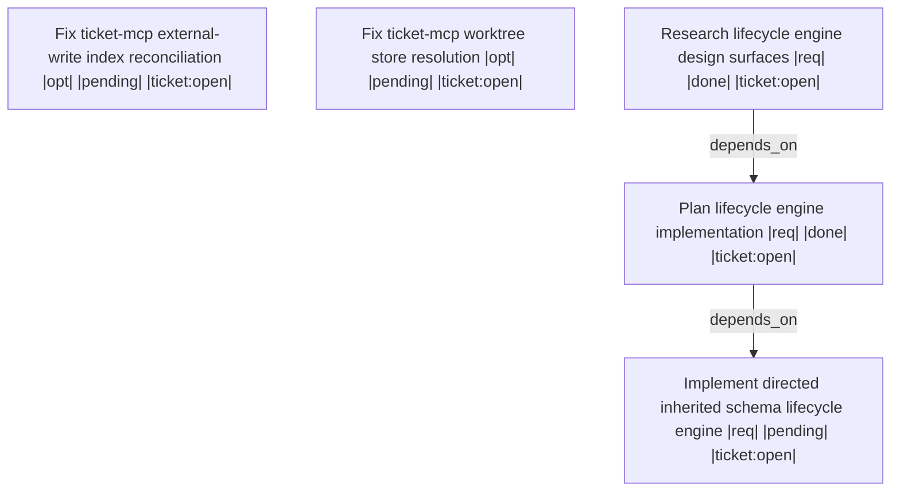

# Handoff: f1521b1e-e3fe-4a04-a444-2421fe345b7a

Deliver the first executable track of schema modernization while preserving shared EntityTypeSchema and SchemaRegistry behavior used across ticket, spec, and rule stores.

## Upward Context
[8fdfe135 Schema modernization implementation track](.ticket/tickets/8fdfe135-e3b1-4876-b638-24154edcd78d/ticket.toml) (epic) -> Schema modernization lifecycle and migration (parent) -> 7ef3f8db-d4a9-4135-99eb-3c006070a328 Implement directed inherited schema lifecycle engine

## Summary
- **Workspace Session**: `epic-kickoff-8fdfe135`
- **Outgoing Run**: `a2659767-3224-48e2-a9a9-72c9582c8515`
- **Created**: 2026-08-06T13:44:08.438112700+00:00
- **Objective**: Implement Track 1's directed inherited schema lifecycle engine for the Schema modernization implementation track.
- **Implementation Ready**: true

## Resume Command
```bash
session-cli resume --workspace-session-id epic-kickoff-8fdfe135 --predecessor-run-id a2659767-3224-48e2-a9a9-72c9582c8515
```

## Target Tickets
| Ticket | What it does | Why |
| --- | --- | --- |
| 7ef3f8db-d4a9-4135-99eb-3c006070a328 Implement directed inherited schema lifecycle engine |  | Track 1 is refined and is the next required workflow node. |

## Target Files
- `memory-api/crates/memory-api/src/model/schema.rs`
- `memory-api/crates/ticket-api/src/model/schema_registry.rs`
- `memory-api/crates/ticket-api/src/model/default_schema.rs`

## Decisions
- Track 1 is the next implementation unit; Track 2, Track 3, Track 4, and Track 6 research stubs remain intentionally gate-deferred.
- Preserve the shared EntityTypeSchema and SchemaRegistry contract across ticket-api, spec-api, and rule-api rather than implementing a ticket-only lifecycle.
- The three divergent Additional Acceptance Criteria sections in ticket 7ef3f8db were merged without loss; byte-identical duplicates in ticket 3eae33fb were reduced to one copy.
- Treat ticket-mcp worktree store resolution and external-write index reconciliation as independent bugs linked for discovery context, not as dependencies of Track 1.

## Non-Goals
- Do not implement Track 2, Track 3, Track 4, or Track 6.
- Do not treat ticket-mcp bug tickets [fa2ba34b ticket-mcp `default` workspace resolves to server cwd, forking the ticket store for worktree agents](.ticket/tickets/fa2ba34b-59ec-4321-a4ce-a3c3a9295ea3/ticket.toml) or [35a60203 ticket-mcp index goes stale against external store writes; reads report on-disk content as absent](.ticket/tickets/35a60203-0a2c-4dbc-b33d-b645848871f2/ticket.toml) as part of the Track 1 code change.
- Do not use ticket-mcp reads as evidence for the currently uncommitted ticket-store repairs; use on-disk files until the reconciliation defect is fixed.

## Context Anchors
- memory-api/crates/memory-api/src/model/schema.rs
- memory-api/crates/ticket-api/src/model/schema_registry.rs
- memory-api/crates/ticket-api/src/model/default_schema.rs
- transcripts/05-08-2026_ticketschema-state-machines/interview.md

## Risk Notes
The working tree has uncommitted changes in .ticket/tickets/7ef3f8db-d4a9-4135-99eb-3c006070a328/description.md and .ticket/tickets/3eae33fb-7289-48fe-8151-7b2077fa810e/description.md plus new manifests for [fa2ba34b ticket-mcp `default` workspace resolves to server cwd, forking the ticket store for worktree agents](.ticket/tickets/fa2ba34b-59ec-4321-a4ce-a3c3a9295ea3/ticket.toml) and [35a60203 ticket-mcp index goes stale against external store writes; reads report on-disk content as absent](.ticket/tickets/35a60203-0a2c-4dbc-b33d-b645848871f2/ticket.toml). Commit or otherwise preserve those ticket-store changes before moving worktrees. ticket-mcp default workspace can resolve to the server cwd rather than an agent worktree, and its index can be stale after file or CLI writes.

## Workflow
- **Nodes**: 5
- **Edges**: 2
- **Not Done**: 3



## Validation
- `track-1-memory-api-tests`: - (required)
- `track-1-ticket-api-tests`: - (required)
