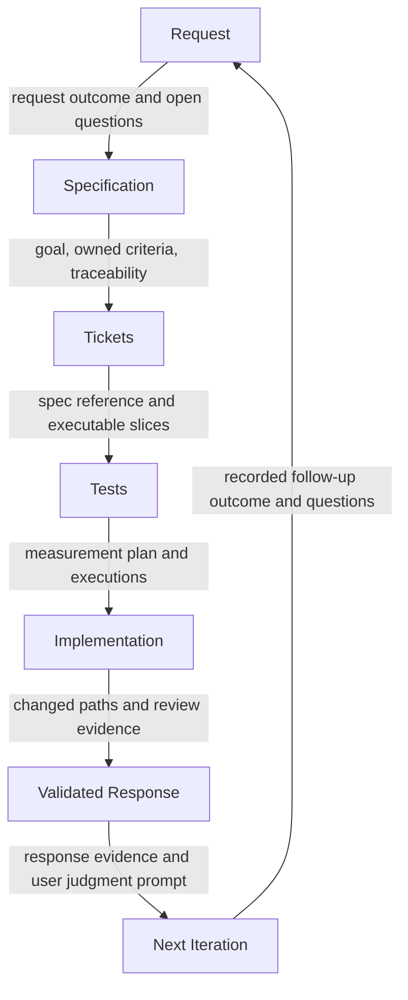

<!-- aligned-structure:v2 -->

# Production Workflow Cycle

## Motivation

Define the durable request-to-judgment loop so an agent can enter at a
proportionate stage, retain the governing outcome through handoffs, and return
evidence rather than an unsupported completion claim.

## Reading Order

1. [.agents/instructions/orchestration/core-cycle.instructions.md](.agents/instructions/orchestration/core-cycle.instructions.md) — governing seven-stage sequence and handoff rule.
2. [e8104080 Production Workflow: Request](.spec/specs/e8104080-df78-46cb-ac64-3bfeb51e583b/body.md) — captures an outcome, constraints, and open questions.
3. [d6b4d989 Production Workflow: Specification](.spec/specs/d6b4d989-f9ac-428a-9dbc-68400006fc96/body.md) — turns a sufficiently understood request into owned criteria.
4. [c522633d Production Workflow: Tickets](.spec/specs/c522633d-7ec8-462a-ae00-30370e37a2d7/body.md) — plans only work that crosses the ticket threshold.
5. [18c1b04d Production Workflow: Tests](.spec/specs/18c1b04d-d23f-4047-9793-5c2af0ee04c1/body.md) — records executable or manual criterion evidence.
6. [44b32c98 Production Workflow: Implementation](.spec/specs/44b32c98-a4cf-4d83-b114-6e5db65b6212/body.md) — changes the approved slice or escalates a deficient handoff.
7. [0013fe78 Production Workflow: Validated Response](.spec/specs/0013fe78-9279-4bb2-8707-e86b6a3dd3b8/body.md) — reports reviewed evidence and limits to the requester.
8. [4199e86c Production Workflow: Next Iteration](.spec/specs/4199e86c-05b0-48a0-bebd-c55efcfa20a5/body.md) — records judgment and closes or seeds the next request.
9. [f1b8f01a Component-Oriented Specification System](.spec/specs/f1b8f01a-c7da-4a71-97c5-39519a7d7f38/body.md) — shared component-contract model for this hierarchy.

## Component Relationship Map

## Shared Invariants

- If this draft is implemented, dependents can rely on each stage consuming the
  named provider criteria in the graph without copying that provider's contract.
- Routing is proportional: a direct free-text task that stays within the small
  change threshold enters Implementation; ticket-only work enters Tickets when
  an approved governing spec already exists; a new or changed requirement enters
  Request then Specification before tickets or code. A ticket never authors the
  requirement it is meant to implement.
- A complete handoff carries the upstream artifact and its unresolved decisions;
  Implementation escalates rather than inventing a contract.
- Test execution evidence is durable only when test-api/test-mcp records the
  execution with `ticket_ids`, `spec_ids`, criterion identifiers, outcome, and
  detail. Ticket completion linkage is specified-but-not-built: current ticket
  lifecycle enforcement does not require or reconcile those executions.
- User satisfaction and follow-up are durable only when feedback-api writes the
  target entity's record to the `.feedback` store. Automatic response-to-feedback
  capture is specified-but-not-built; no prose claim substitutes for that record.
- Position: `partial`; the guidance and stores exist, but this draft has no
  recorded guards. [.agents/instructions/spec/spec-system.instructions.md](.agents/instructions/spec/spec-system.instructions.md) is the governing rule.

## Examples

A user asks for a two-file behavior fix with stable requirements. The Request
and Specification stages are unnecessary; Implementation validates the changed
slice and returns its command outcome. Conversely, a new cross-component feature
starts with a request dossier and draft spec, passes user review, then Tickets
creates the execution plan before Tests and Implementation proceed.

## Scope

This root owns cross-stage navigation, routing, and shared invariants. Its seven
children own observable behavior, boundaries, provider criteria, and evidence.
