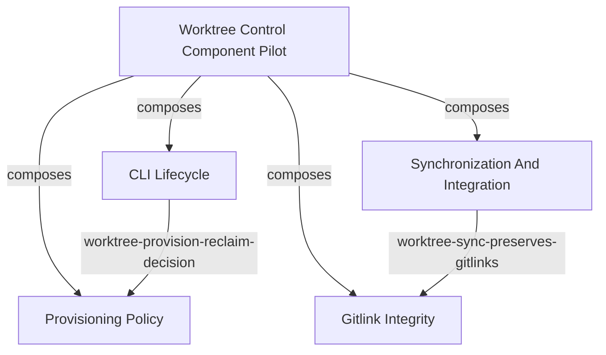

<!-- aligned-structure:v2 -->

# Worktree Control Component Pilot

## Target Code Location

[workflow-tools/session/crates/worktree-ctl/src/main.rs](../../../workflow-tools/session/crates/worktree-ctl/src/main.rs) is the CLI composition entry point; [workflow-tools/session/crates/session-worktree-provision/src/lib.rs](../../../workflow-tools/session/crates/session-worktree-provision/src/lib.rs) is the shared provisioning-library boundary.

## Naming Conventions

The future persisted parent `component_id` is `worktree-control-pilot`; child
identities are `worktree-control-cli`, `worktree-provisioning-policy`,
`worktree-synchronization`, and `worktree-gitlink-integrity`. Use the existing
`worktree-cli-`, `worktree-provision-`, `worktree-sync-`, and `worktree-gitlink-`
criterion prefixes; these identifiers are contract targets, not claims that the
typed model is implemented.

## Motivation

Validate component composition, parent-owned criteria, provider/consumer interfaces, reusable criterion templates, and the source-annotation workflow against implemented worktree control code before broad adoption.

## Reading Order

1. [191ceae7 Worktree Control CLI Lifecycle](../191ceae7-663e-448b-bb04-46f46f38825d/body.md) - CLI lifecycle component.
2. [c1d13a73 Worktree Provisioning Policy](../c1d13a73-3265-42e1-8da0-5c44ef7b61ff/body.md) - provisioning library component.
3. [c40b790f Worktree Synchronization And Integration](../c40b790f-6704-4a5e-bc62-ae7599521a7c/body.md) - synchronization component.
4. [a623ea02 Worktree Gitlink Integrity](../a623ea02-e1a9-4c8c-81ea-f1f5fb3b4a9f/body.md) - gitlink component.
5. [e82b9727 Criterion Template Contract](../e82b9727-0ea2-4d1d-ab8a-98141f85caef/body.md) - specified-but-not-built template model used by the pilot.
6. [7766e61d Rust Source Annotation Traceability Contract](../7766e61d-dea9-4292-bde5-dfc287b8da3b/body.md) - specified-but-not-built source-resolution workflow.

## Component Relationship Map

## Shared Invariants

Parent-owned composition criteria must require all four persisted child
`component_id` values, their expected shape, and only the shown relationships.
The documented intended provisioning relationship is distinct from implemented
delegation: `main.rs` uses `WorktreeGit` and `evaluate_reclaim_candidate`, but
does not call `provision_for_session`; `sync.rs` and `gitlink.rs` use
`WorktreeGit`, not `ProvisionPolicy` or provisioning behavior. The pilot is
blocked until composition, provider edges, and template bindings are persisted
and health-validated, and research establishes an accurate Git-operation
provider boundary. There is no MCP surface, so no CLI/MCP/API parity criterion is claimed.

## Examples

The expected composition graph is the Mermaid graph above. A future template
may bind a concrete provider-owned criterion artifact, but no template output,
annotation, or macro exists today. A manual source review may associate
`dispatch` with `worktree-control-cli` and a provider-owned `criterion_id` only
after the persistent model exists.

## Evidence

Position: `partial`: code and integration tests are implemented; typed identity,
composition criteria, provider edges, template persistence, health validation,
and source annotations are specified-but-not-built. Validate with `cargo test --manifest-path workflow-tools/session/Cargo.toml -p worktree-ctl` and a manual source review that confirms the graph does not claim provisioning delegation.

## Scope

This pilot specifies existing component relationships for evaluation only. It does not alter `worktree-ctl`, introduce macros, or generalize the model beyond the review outcome.
