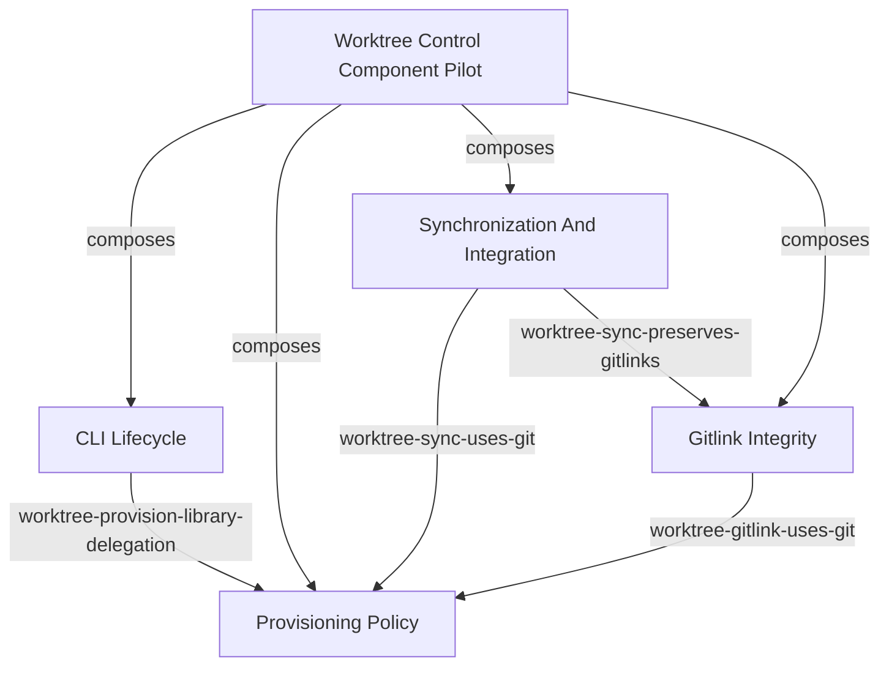

<!-- aligned-structure:v2 -->

# Worktree Control Component Pilot

## Target Code Location

[workflow-tools/session/crates/worktree-ctl/src/main.rs](../../../workflow-tools/session/crates/worktree-ctl/src/main.rs) is the CLI composition entry point; [workflow-tools/session/crates/session-worktree-provision/src/lib.rs](../../../workflow-tools/session/crates/session-worktree-provision/src/lib.rs) is the shared provisioning-library boundary.

## Naming Conventions

Use `worktree-ctl` for the composed parent component, `worktree-cli-`, `worktree-provision-`, `worktree-sync-`, and `worktree-gitlink-` criterion prefixes, and the child component identities linked below.

## Motivation

Validate component composition, parent-owned criteria, provider/consumer interfaces, reusable criterion templates, and the source-annotation workflow against implemented worktree control code before broad adoption.

## Reading Order

1. [191ceae7 Worktree Control CLI Lifecycle](../../191ceae7-663e-448b-bb04-46f46f38825d/body.md) - CLI lifecycle component.
2. [c1d13a73 Worktree Provisioning Policy](../../c1d13a73-3265-42e1-8da0-5c44ef7b61ff/body.md) - provisioning library component.
3. [c40b790f Worktree Synchronization And Integration](../../c40b790f-6704-4a5e-bc62-ae7599521a7c/body.md) - synchronization component.
4. [a623ea02 Worktree Gitlink Integrity](../../a623ea02-e1a9-4c8c-81ea-f1f5fb3b4a9f/body.md) - gitlink component.
5. [e82b9727 Criterion Template Contract](../../e82b9727-0ea2-4d1d-ab8a-98141f85caef/body.md) - specified-but-not-built template model used by the pilot.
6. [7766e61d Rust Source Annotation Traceability Contract](../../7766e61d-dea9-4292-bde5-dfc287b8da3b/body.md) - specified-but-not-built source-resolution workflow.

## Component Relationship Map

## Shared Invariants

Parent-owned criteria require all four child components to exist with the shown relationships, CLI lifecycle handlers to delegate provisioning policy to the shared library rather than duplicate it, and [workflow-tools/session/crates/worktree-ctl/tests/worktree_contracts.rs](../../../workflow-tools/session/crates/worktree-ctl/tests/worktree_contracts.rs) plus [workflow-tools/session/crates/worktree-ctl/tests/maintenance.rs](../../../workflow-tools/session/crates/worktree-ctl/tests/maintenance.rs) to cover integration behavior. There is no MCP surface, so no CLI/MCP/API parity criterion is claimed.

## Examples

The expected composition graph is the Mermaid graph above. A specified-but-not-built template binds `owner = worktree-ctl`, `cli = worktree-ctl`, and `provider = session-worktree-provision` to generate a criterion requiring lifecycle commands to delegate policy. A future manual/source-resolution review associates `dispatch` and policy functions with component/criterion ids, but no annotations or macros are claimed to exist.

## Evidence

Position: `partial`: code and integration tests are implemented; template persistence and source annotations are specified-but-not-built. Validate with `cargo test --manifest-path workflow-tools/session/Cargo.toml -p worktree-ctl` and a manual review that confirms the graph, parent criteria, and source-resolution workflow.

## Scope

This pilot specifies existing component relationships for evaluation only. It does not alter `worktree-ctl`, introduce macros, or generalize the model beyond the review outcome.
