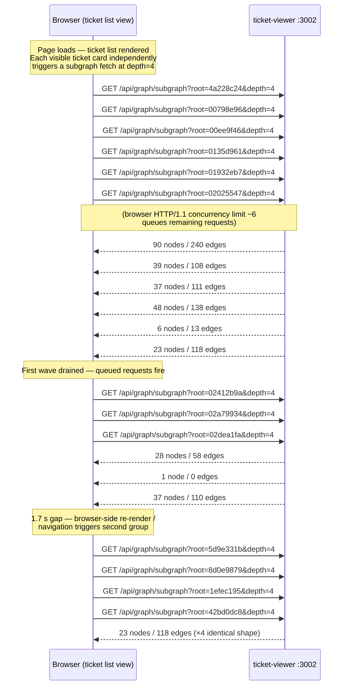

# Subgraph Request Fan-Out Analysis
**Date:** 2026-05-03  
**Server:** ticket-viewer (port 3002)  
**Session:** `viewer-ctl start ticket-viewer --fg`, ~8 seconds before Ctrl-C

---

## 1. Request Timeline

All 13 observed requests arrive within ~4.1 seconds of the page loading.
Server-side latency is negligible (0–2 ms each); all time is in the client.

```mermaid
gantt
    title Subgraph Requests — server-received timestamps (offset from T₀ = 14:41:28.550)
    dateFormat x
    axisFormat +%Lms

    section Wave 1  (9 req, 495 ms)
    4a228c24  90n 240e  :done, r1,  0,   3
    00798e96  39n 108e  :done, r2, 34,  59
    00ee9f46  37n 111e  :done, r3, 57,  62
    0135d961  48n 138e  :done, r4, 123, 192
    01932eb7   6n  13e  :done, r5, 212, 214
    02025547  23n 118e  :done, r6, 322, 323
    02412b9a  28n  58e  :done, r7, 358, 360
    02a79934   1n   0e  :done, r8, 366, 369
    02dea1fa  37n 110e  :done, r9, 391, 495

    section Gap (1 677 ms — browser processing / connection drain)
    (waiting)           :crit, gap, 495, 2172

    section Wave 2  (4 req, 1 956 ms)
    5d9e331b  23n 118e  :done, r10, 2172, 2175
    8d0e9879  23n 118e  :done, r11, 2874, 2876
    1efec195  23n 118e  :done, r12, 3343, 3345
    42bd0dc8  23n 118e  :done, r13, 4128, 4131
```

---

## 2. Pattern: Per-Ticket N+1 Subgraph Fetches

---

## 3. Key Observations

| # | Observation | Detail |
|---|-------------|--------|
| 1 | **N+1 fetch pattern** | One `GET /subgraph` per ticket in the list view. 13 tickets visible → 13 round trips. Scales linearly with ticket count. |
| 2 | **HTTP/1.1 connection stacking** | Wave 1 fires 9 requests; the browser connection limit (~6) queues the last 3, creating the observed staggered arrival. |
| 3 | **Server latency is not the bottleneck** | All responses complete in 0–2 ms. Total round-trip cost is dominated by HTTP overhead and browser concurrency limits. |
| 4 | **1.7 s gap between waves** | Wave 2 starts at +2 172 ms, well after wave 1 drained (+495 ms). Likely a re-render cycle or navigation event triggering a second fan-out. |
| 5 | **Wave 2 returns identical payloads** | All 4 wave-2 responses: 23 nodes / 118 edges. These are probably the same root ticket (or the same subgraph) fetched repeatedly — possibly a reactive signal firing on each list-item render. |
| 6 | **depth=4 is fixed** | Every request uses `depth=4` regardless of whether the full depth is needed for rendering. This inflates response sizes (up to 240 edges) for contexts that only need 1–2 hops. |

---

## 4. Root Cause Hypothesis

The list view fetches the **full subgraph** for every rendered ticket card individually, rather than:
- batching all roots into a single request, or
- deferring the fetch until a card is expanded/selected, or
- fetching only the flat ticket list and lazy-loading graph data.

Wave 2's identical 23n/118e payloads suggest a reactive component is re-fetching on each render cycle, compounding the N+1 cost.

---

## 5. Potential Fixes (not yet scoped)

1. **Lazy/on-demand fetch** — only call `/subgraph` when a ticket is expanded or hovered, not on list render.
2. **Batch endpoint** — add a `POST /api/graph/subgraph/batch` accepting multiple roots; server returns all in one response.
3. **Reduce depth** — pass `depth=1` or `depth=2` for the list preview; fetch `depth=4` only on drill-down.
4. **De-duplicate signal firing** — ensure the reactive component does not re-fetch on every re-render when the root ID has not changed.
