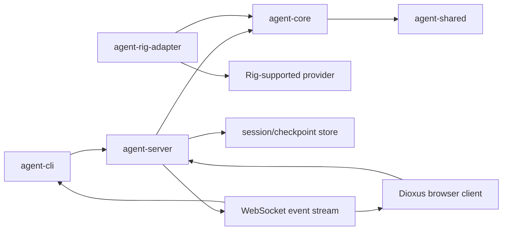
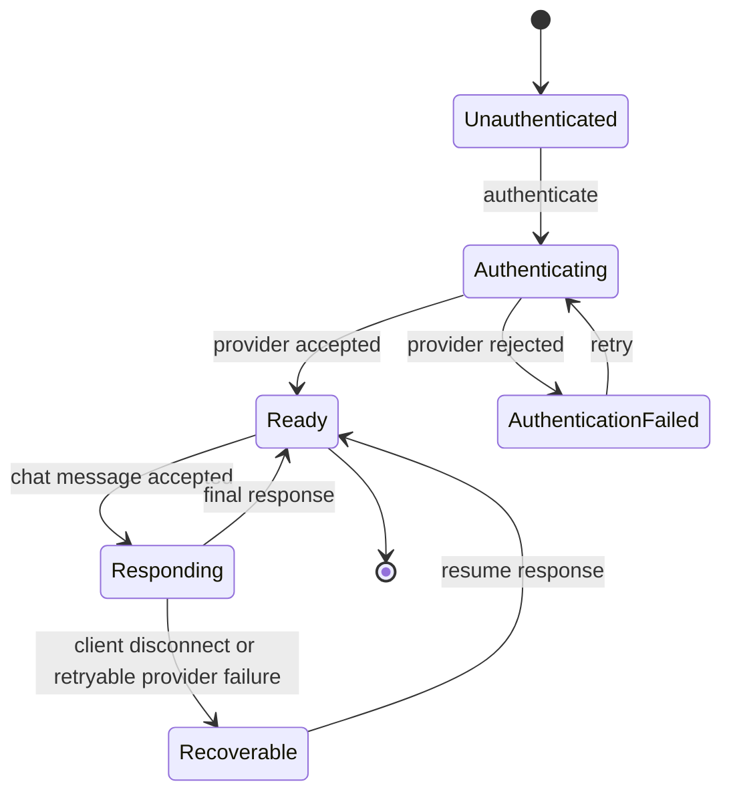

# Specification Draft: Rig-Based Chat Extension for the Unified Agent Harness

**Target spec:** `agent-harness/unified-operator-interface` (`6f286eee`)

## Goal

Extend the Unified Agent Harness with a provider-neutral chat capability whose
first provider adapter uses the Rust `rig` library. A user must be able to
authenticate, send a chat message with an optional file attachment, and read a
streamed or final answer through both a CLI and a Dioxus browser client.

The extension preserves the existing single-session model: interactive chat and
long-running loops remain modes of the same session, and all clients consume the
same authoritative server event stream.

## Semantic Model

This specification defines a system of typed entities, relations, and invariants.
Each component is an independently modelled domain, like a database relation with
an explicit schema and integrity constraints. A compliant implementation may use
different internal algorithms, transports, storage engines, or UI layouts, but it
must preserve every stated type boundary, relation, and invariant.

### Entity Types

| Type | Identity | Required relation |
|---|---|---|
| `Session` | `session_id` | Owns commands, authentication state, messages, and response events. |
| `CredentialCapability` | opaque, non-persisted capability | Authorizes provider access for exactly one session context. |
| `ChatMessage` | `message_id` within a session | May reference zero or more attachments. |
| `Attachment` | `attachment_id` | Has metadata and a separately stored content representation. |
| `Response` | `message_id` and event sequence | Belongs to exactly one accepted chat message. |
| `ProviderAdapter` | implementation identity | Implements the provider contract without leaking provider types across the boundary. |
| `Client` | client identity and session subscription | Observes and commands sessions only through the public protocol. |

### Global Invariants

1. A `Session` is the sole authority for the identity and ordering of its commands,
   authentication state, messages, and response events.
2. A `ChatMessage` is accepted only when its `Session` has an authenticated
   `CredentialCapability` and every referenced `Attachment` is valid.
3. A `Response` is related to one and only one accepted `ChatMessage`; response
   events are strictly ordered within that response.
4. Raw credential material is not a value of any persisted entity or client-visible
   protocol entity.
5. Provider-specific values, including `rig` types, do not cross the
   `ProviderAdapter` contract boundary.
6. A client observes a session only through the public protocol; client
   implementation details cannot change session truth.

### Conformance Boundaries

The specification does not prescribe a full editor, Git browser, native Dioxus
target, particular database, or a particular set of `rig` providers. Those
features are separate only when they do not alter the entity types or invariants
defined here. Any future feature that introduces a new entity, relation, or
authority boundary requires a corresponding specification extension.

## Architecture

The dependency direction is intentional: `agent-shared` has no application
dependencies; `agent-core` depends on `agent-shared`; `agent-rig-adapter`
depends on the provider trait exposed by `agent-core`; `agent-server` depends on
the core; clients depend on shared protocol definitions and the server transport,
but not on `agent-core` or `rig`.

## Component Schemas

### `agent-shared` — Session Protocol

**Responsibility:** Define provider-neutral, versioned schemas that are safe to
serialize across process and WebSocket boundaries.

**Inputs:** Client commands and server/core event values.

**Outputs:** Tagged serde messages.

**Required message families:**

| Family | Required fields | Invariant |
|---|---|---|
| `SessionCommand` | `session_id`, `command_id`, command payload | `command_id` is unique within a session. |
| `Authenticate` | `session_id`, opaque credential reference or credential submission | Raw credentials are never included in persisted events. |
| `ChatMessage` | `session_id`, `message_id`, text, attachment references | A message is immutable after acceptance. |
| `AttachmentRef` | `attachment_id`, filename, media type, byte length, content reference | Bytes are not embedded in event logs. |
| `ResponseEvent` | `session_id`, `message_id`, sequence number, kind, payload | Sequence numbers are monotonic per response. |
| `AuthState` | `session_id`, state, safe error code | Client-visible state contains no secret material. |

**Acceptance criteria:**

1. Every public message is a tagged serde enum or struct with a stable versioned
   representation.
2. Serializing then deserializing each message preserves the full public value.
3. Schema tests prove that `AttachmentRef` and `AuthState` cannot carry a raw
   provider credential.

**Validation:** `cargo test -p agent-shared`.

### `agent-core` — Session and Chat Orchestrator

**Responsibility:** Own the authoritative state machine, provider abstraction,
message ordering, policy checks, and checkpoint intent.

**Inputs:** `SessionCommand`, authenticated provider capability, attachment
metadata, policy/budget decisions.

**Outputs:** `ResponseEvent` stream, lifecycle transitions, checkpoint records,
typed failures.

**Provider boundary:** Expose a provider trait for `authenticate`, `send`, and
optional `stream`. The provider trait accepts normalized requests and returns
normalized events; it does not expose `rig` types.

**State transition schema:**

**Acceptance criteria:**

1. The core rejects a chat command before authentication is successful.
2. A successful chat command produces ordered events ending in exactly one final
   response or one typed failure.
3. Attachment metadata is validated before a provider request begins.
4. Provider errors, policy denials, and authentication failures are distinguishable
   typed outcomes.
5. Core tests use a mock provider; no unit test requires network access.

**Validation:** `cargo test -p agent-core` with mock provider cases for accepted
text, authentication failure, invalid attachment metadata, event ordering, and
budget/policy denial.

### `agent-rig-adapter` — Rig Provider Adapter

**Responsibility:** Implement the `agent-core` provider trait with Rust `rig`.

**Inputs:** Normalized authentication request and normalized chat/attachment
request from `agent-core`.

**Outputs:** Normalized authentication result and response events.

**Rules:**

- The adapter is the only agent-harness crate that imports `rig`.
- The adapter maps `rig` errors to provider-neutral error categories.
- The adapter exposes a fake/local transport seam for tests.
- The adapter never writes raw credentials into logs or normalized events.

**Acceptance criteria:**

1. A fake adapter test proves request conversion, authentication result mapping,
   streaming event conversion, and redacted error mapping.
2. No integration test needs an external provider account or network connection.
3. Replacing the adapter does not require changing `agent-shared`, `agent-core`,
   `agent-server`, or either client.

**Validation:** `cargo test -p agent-rig-adapter`.

### `agent-server` — Authenticated Session Transport

**Responsibility:** Own authenticated transport endpoints, attachment storage
references, command dispatch to the core, event fan-out, and reconnect lookup.

**Inputs:** CLI or browser HTTP/WebSocket requests.

**Outputs:** HTTP acceptance/rejection responses and WebSocket `ResponseEvent`
frames correlated by session and message.

**Required endpoints or equivalent protocol operations:**

| Operation | Input | Result |
|---|---|---|
| Authenticate | credential submission or configured credential reference | safe `AuthState` transition |
| Send chat | text and session identifier | command acknowledgement and event stream |
| Attach file | file bytes plus metadata | validated `AttachmentRef` or typed rejection |
| Subscribe | session identifier and resume cursor | ordered event frames from the cursor |

**Acceptance criteria:**

1. Two observers of one session receive the same ordered response stream.
2. A reconnecting client can request events after its last acknowledged sequence.
3. The server stores attachment bytes outside event logs and exposes only an
   `AttachmentRef` to `agent-core`.
4. Authentication failures and invalid attachments return safe, typed errors.

**Validation:** `cargo test -p agent-server` with an in-process Axum server and
a fake Rig adapter.

### `agent-cli` — Scriptable Operator Client

**Responsibility:** Provide a thin, automation-friendly interface over the public
server protocol.

**Inputs:** Auth command, text prompt, attachment path, session identifier, and
response-stream selection.

**Outputs:** Ordered response frames or final text to stdout; typed errors to
stderr; no secrets in either output.

**Acceptance criteria:**

1. The CLI can authenticate against the fake server.
2. The CLI can submit text and print a final answer.
3. The CLI can attach a fixture file and observe the answer that references the
   attachment.
4. Invalid authentication exits non-zero with a redacted error.

**Validation:** black-box integration tests that start the fake server, invoke
the CLI binary, and assert exit status plus sanitized output.

### Dioxus Browser Client — Interactive Chat Surface

**Responsibility:** Render authentication, chat composition, attachment state,
progressive answer output, and recoverable failures in a browser.

**Inputs:** User interaction and server event frames.

**Outputs:** Protocol commands plus an accessible visual representation of the
current session state.

**Required states:** unauthenticated, authenticating, ready, sending, streaming,
final response, and recoverable error.

**Acceptance criteria:**

1. A user can authenticate using a test credential and see the ready state.
2. A user can submit a text message and see progressive output then final text.
3. A user can select or drag a fixture file into the composer, see the attachment
   name, submit it, and see the final answer.
4. Invalid authentication shows a safe error with no token disclosure.
5. Reconnecting preserves the session and resumes visible response output.

**Validation:** Playwright tests against the fake server, trace and screenshot
artifacts for each flow, plus one external Chromium smoke run at a recorded
resolution.

## End-to-End Verification Matrix

| Scenario | Core/adapter test | CLI integration | Browser Playwright | Manual evidence |
|---|---|---|---|---|
| Authenticate successfully | mock auth result | CLI exits zero | ready state visible | Chromium screenshot |
| Reject invalid authentication | typed auth failure | redacted non-zero error | safe error state | screenshot |
| Send text and read answer | ordered response events | final stdout answer | progressive and final text | screenshot + trace |
| Attach file and read answer | attachment validation | fixture accepted and referenced | select/drop, submit, final answer | screenshot + trace |
| Reconnect while streaming | resume cursor ordering | resumed output | recovered stream UI | Chromium smoke |

## Acceptance Criteria for the Extension

1. The workspace has a modular, provider-neutral core and a distinct Rig adapter
   that contains every direct `rig` dependency.
2. A fake Rig-backed system supports authentication, a text chat message, one
   fixture attachment, and a streamed or final answer without network access.
3. The CLI and Dioxus browser client exercise the same public server protocol and
   preserve session identity across reconnect.
4. Automated tests cover every row of the verification matrix.
5. Browser validation produces Playwright traces/screenshots and an external
   Chromium evidence record.
6. Raw credentials are absent from protocol events, checkpoints, logs, CLI output,
   and browser-visible state.

## Traceability and Required Follow-Up

- Extend spec `6f286eee` rather than creating a parallel agent-harness spec.
- Amend the CH3 provider decision because CH3 currently names `genai`; record the
  approved `rig` integration approach and authentication contract.
- Add a dedicated Rig adapter ticket before implementation, depending on CH2 and
  the CH3 amendment.
- Extend CH6 with attachment and resume semantics, CH7 with CLI evidence, CH8 with
  the Dioxus chat flows, and CH11 with the browser matrix above.
- Preserve the current tracker `0f4b3c5b` and its sandbox, MCP-routing, event
  streaming, and browser-evidence requirements.